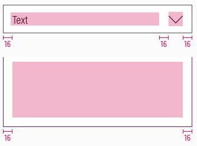

<AlertInfo alertHeadline="Modifiable">
Please ensure to comply with the corporate identity. A detailed list what can be modified can be found [here](#what-can-be-modified).
</AlertInfo>

# Accordion

Use an accordion to manage a large amount of content through dynamic switching.

Parts of the content are hidden in a container and only displayed by the user's action.

---

## Overall styling

- The text-style is [basic](../../General/Typography/Typography.md#basic).
- The line-height is set to **default**.
- The outline has a **1px thickness**.

### Accordion

- The default/hover/focus state uses **"arrow-down"** and the open state use **"arrow-up"** as an icon.

| States | Attributes | Preview |
|---|---|---|
| Default | text-color: basic-black outline-color: gray-dark icon-color: basic-black background-color: basic-white |  |
| Hover | text-color: basic-black outline-color: brand-primary-base icon-color: basic-black background-color: basic-white |  |
| Focus | text-color: brand-primary-base outline-color: brand-primary-base icon-color: basic-black background-color: basic-white |  |
| Opened | text-color: brand-primary-base outline-color: brand-primary-base icon-color: basic-black background-color: basic-white |  |
| Disabled | text-color: gray-dark outline-color: gray-base icon-color: gray-dark background-color: gray-lightest |  |

### Content

| States | Attributes | Preview |
|---|---|---|
| Opened | outline-color: brand-primary-base background-color: basic-white |  |

---

## Spacing & measurements

- Width depends on device and usage.
- Only the height for the content symbol is free adjustable.

### Measurements

| Types | Attributes | Preview
|---|---|---|
| Horizontal spacing | padding: 16px margin: 16px |  |
| Vertical spacing | padding-top: 8px padding-bottom: 16px |  |
| Height | LG: 48px MD-XS: 40px |  |
| Size | icon: 24x24px |  |
| Text length ends with ellipsis | padding-right: 16px |  |

### Spacing

| Types | Attributes | Preview
|---|---|---|
| Spacing | 8px between different components content opens downwards. |  |

---

## What can be modified?

- Override the text.
- Adjust the width.
- Adjust the height but only for the "content" symbol.
- Modify the complete look of the symbol but please stick to the colors of the given states.

### Our workflow in Sketch

- Use the "Overrides"-function to customize your accordion element (i.e. select the correct status you want to display).
- Place the "content" symbol directly under the accordion to display an open status.
