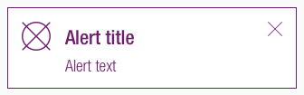
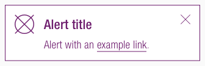
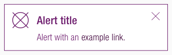

<AlertInfo alertHeadline="Modifiable">
Please ensure to comply with the corporate identity. A detailed list what can be modified can be found [here](#what-can-be-modified).
</AlertInfo>

# Alerts

Different types of notifications with contextual feedback about user actions as well as permanent presentation of important information.

---

## Recommendations

- **Keep the alerts text as short as possible. Especially the title.**
- Use an alert, i.e for feedback, recalls or support.
- Use links in the alert with caution. It might be more appropriate to link the entire alert instead of one word.

---

## Overall styling

- The text style is **large-bold** for the **title** and **basic** for the **text**.
- Every variant uses **basic-white** as background-color.
- The border has a **thickness of 1px**.
- The line-height for the "alert title" is **120%**, it stays **140%** for the "alert text".
- All widths are individually adjustable and fit into the layout columns and the 8-point-grid.
- The height depends on the content and the additional components shown.
- Every alert comes with the icon "cross.svg" as "close"-icon in the right upper corner.
- The color of the icon "cross.svg" stays the same in the focus/hover state. Only the cursor changes to pointer.

### Title & icon

- Some alerts come with an additional fixed icon to emphasize their meaning.

| Version | Attributes | Preview |
|---|---|---|
| primary | text-color: brand-primary-base outline-color: brand-primary-base icon-color: brand-primary-base icon: information-circle.svg (currently placeholder.svg) |  |
| info | text-color: brand-info-darker outline-color: brand-info-base icon-color: brand-info-darker fixed icon: information-circle.svg |  |
| danger | text-color: danger-darker outline-color: danger-base icon-color: danger-darker fixed icon: exclamation-triangle.svg |  |
| success | text-color: success-darker outline-color: success-base icon-color: success-darker fixed icon: hook-circle.svg |  |
| gray / neutral | text-color: basic-black outline-color: gray-dark icon-color: basic-black icon: not fix (currently placeholder.svg) |  |

### Text

- Simple alerts to only display text.

| Version | Attributes | Preview |
|---|---|---|
| primary | text-color: brand-primary-base icon-color: brand-primary-base outline-color: brand-primary-base |  |
| info | text-color: brand-info-darker icon-color: brand-info-darker outline-color: brand-info-base |  |
| danger | text-color: danger-darker icon-color: danger-darker outline-color: danger-base |  |
| success | text-color: success-darker icon-color: success-darker outline-color: success-base |  |
| gray / neutral | text-color: basic-black icon-color: basic-black outline-color: gray-dark |  |

---

## Link

Some alerts use links to direct the user to another page.

- Every variant uses the **basic-white** as **text-color**.
- In the default/hover/focus state the **text-decoration** is **underline**.

| State | Attributes | Preview |
|---|---|---|
| Default / visited |  |  |
| Hover / focus | cursor: changes to pointer  |  |
| Active / pressed | text-decoration: none |  |

---

## Spacing & Measurements

| Types | Attributes | Preview |
|---|---|---|
| Horizontal spacing | padding: 16px |  |
| Vertical spacing | padding: 16px margin-bottom: 8px |  |
| Icon size | meaning: 32x32px close: 16x16px |  |

---

## What can be modified?

- Override the text and icons.
- Adjust the width and height according to the content.
- Modify alerts to your project needs by adding other symbols or styles (i.e. like dividers or links).

### Our workflow in Sketch

- Use the „Overrides“-function to select the required variant, to edit the content, to change the icon if necessary or if the alert can’t be closed.
