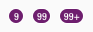
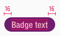
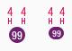
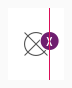

<AlertInfo alertHeadline="Modifiable">
Please ensure to comply with the corporate identity. A detailed list what can be modified can be found [here](#what-can-be-modified).
</AlertInfo>

# Badges

Use it for a number of functions, but mostly to demonstrate status and progress to the customer.

Basically it is positioned in a context with a text.

---

## Versions

- There are different versions of the badge: **standard** and **addon**.

| Standard | Addon |
|---|---|
| Use it in conjunction with text. | Used in the user-navigation of the header. |

---

## Recommendations

- If you decide to use a badge, never use more than a maximum of 2 variations.
- Keep the text in a badge as short as possible.

---

## Overall styling

- The text-style or font-size depends on the component but is always **bold**.
- The text-color always is **basic-white**.
- The line-height is **120%**.
- The border is in **basic-white** with a **1px thickness**.
- It always has rounded corners of **50% of its height**.

---

## Standard

- This badge is called **standard** and should be used in conjunction with text.
- It comes in **different sizes** depending of the corresponding text-styles.
- Please use the badge corresponding to the breakpoint since there are different sizes.
- The badge these colored variations: **primary** and **info**.

| Types | Attributes | Preview |
|---|---|---|
| Primary | text-style: small, basic, large background-color: brand-primary-base |  |
| Info | text-style: small, basic, large background-color: info-base | |

### States

- A badge can also be given as a link.
- The only thing that changes is the background-color.

| Types | Attributes | Preview |
|---|---|---|
| Default | background-color: brand-primary-base, info-base |  |
| Hover / focus and active | background-color: brand-secondary-base, info-darker |  |

---

## Addon

- This badge is called **addon** and is only used in the user-navigation section of the header.
- It comes in 3 different sizes depending on the breakpoints.

| Breakpoints | Attributes | Preview |
|---|---|---|
| LG | font-size: 12px line-height: 100% background-color: brand-primary-base  |  |
| MD-XS | font-size: 10px line-height: 100% background-color: brand-primary-base |  |

---

## Usage

- Stick to the following examples to implement a **badge-standard** in combination with a text.

### Headlines

| Text style | Attributes | Preview |
|---|---|---|
| Headline 1 | text-style: headline 1 badge: large |  |
| Headline 2 | text-style: headline 2 badge: basic |  |
| Headline 3 | text-style: headline 3 badge: basic |  |
| Headline 4 | text-style: headline 4 badge: basic |  |
| Headline 5 | text-style: headline 5 badge: small |  |

### Text

| Text style | Attributes | Preview |
|---|---|---|
| Small | text-style: small(-bold) badge: small |  |
| Basic | text-style: basic(-bold) badge: basic |  |
| Large | text-style: large(-bold) badge: large |  |

---

## Spacing & Measurements

- Note that the badge element has a **1px basic-white** border.

### Standard

| Types | Attributes | Preview |
|---|---|---|
| Horizontal spacing | padding: 16px |  |
| Vertical spacing | text optically, vertically centered |  |
| Height (LG) | small: 27px basic: 32px large: 37px |  |
| Height (MD-XS) | small: 25px basic: 30px large: 35px |  |
| Distances | margin: 8px |  |

### Addon

| Types | Attributes | Preview |
|---|---|---|
| Horizontal spacing | padding: 4px |  |
| Height | LG: 20px MD-XS: 16px |  |
| Position | Overlaps an icon by 50% to the right Text expands the element to the left  |  |

---

## What can be modified?

- Override the text.
- Adjust the width according to the text.
- Modify badges to your project needs by changing colors of background, outline and text.
