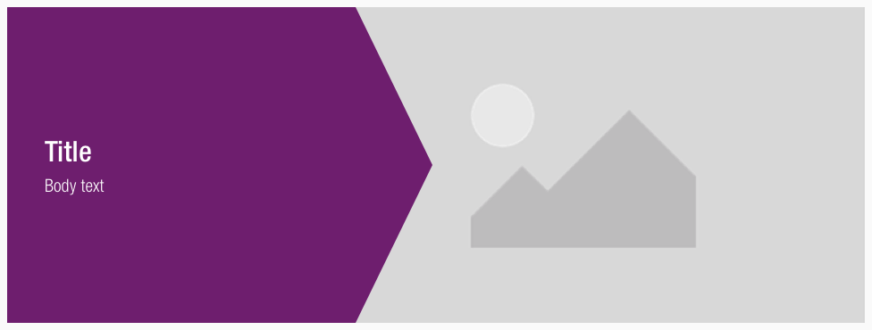
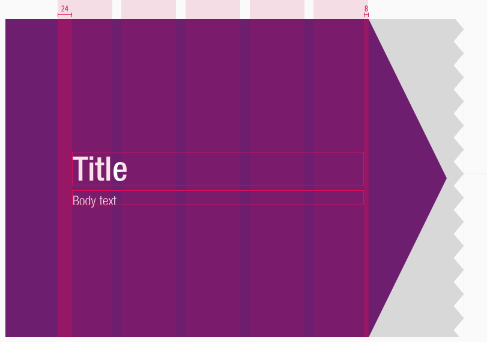
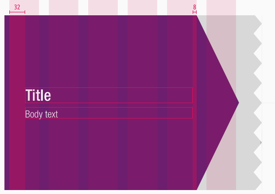
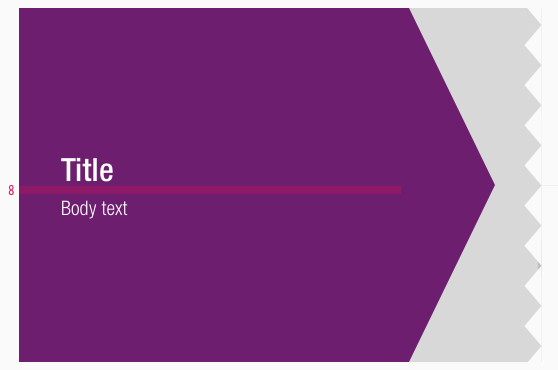
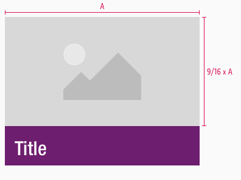
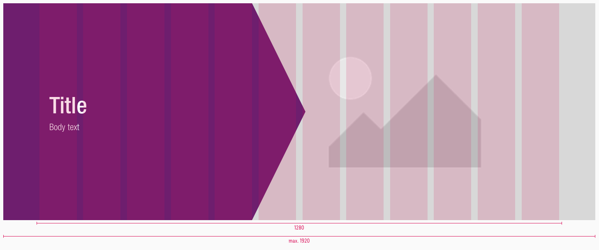
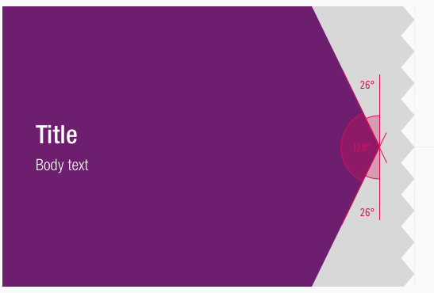

<AlertInfo alertHeadline="Modifiable">
Please ensure to comply with the corporate identity. A detailed list what can be modified can be found [here](#what-can-be-modified).
</AlertInfo>

# Banner

The banner element is mainly used to create a focus  on a certain topic.

This focus is underlined with the help of a headline, text and image to give the user more information.

---

## Recommendations

- Keep the text short.
- The body text in our tablet portrait and smartphone components shouldn't be longer than a maximum of two lines.
- If the body text is longer than two lines it ends with ellipsis.

---

## Overall styling

- It has **no hover** or **focus** state.
- The headline uses the text-style **display 1**.
- The body-text comes in the text-style **basic**.
- The line-height of the display text-style is set to **100%**.
- There is **no inverted variant** for portrait tablet (SM) and smartphone (XS) breakpoints because the textual part always is placed under the image with a colored background.
- The picture is set to a **16:9** but can be adjusted to any preferred ratio.
- The text always is placed on the plain color and never on an image.

---

## Variants

- The banner is available in **default** and **inverted**.
- It's further clustered into **positive** and **negative**.

### Default

- The text is placed on the arrow element, the picture is situated behind it.

| Types | Attributes | Preview |
|---|---|---|
| Positive | text-color: basic-white background-color: brand-primary-base |  |
| Negative | text-color: brand-primary-base (headline), basic-black (text) background-color: gray-lightest |  |

### Inverted

- The picture is placed in the arrow element, the text stays on its background.

| Types | Attributes | Preview |
|---|---|---|
| Positive | text-color: basic-white background-color: brand-primary-base |  |
| Negative | text-color: brand-primary-base (headline), basic-black (text) background-color: gray-lightest |  |

---

## Possible adjustments

- This adjustments mainly concern the components with an arrow element.
- The peak of the arrow element can be positioned at any column of the grid but it always has to keep its defined angle.
- Please pay attention that the **colored area doesn't take more than 50%** of the layout.
- There should be **enough space** for the textual part as well.

---

## Spacing & Measurements

### Spacing

| Types | Attributes | Preview |
|---|---|---|
| Horizontal spacing | padding: 112px / 146px (LG) padding: 40px / 80px (MD) padding: 16px (SM+XS) *text is horizontally centered* |     |
| Vertical spacing | margin-bottom: 8px (all breakpoints) padding: 16px (SM+XS)|   |

### Measurements

- The width of the symbol always adapts to the viewport – up to a maximum of 1920px.

| Types | Attributes | Preview |
|---|---|---|
| Height | Depends on the image ratio but is set to  9/16 of the image width The textual section depends on the content but has a fixed padding|   |
| Width | LG: 1280px (max. 1920px) MD: 960px SM: 600px XS: 320px |     |
| Angle | Outer angle: 26° Inner angle: 128° |  |

---

## What can be modified?

- Override the text.
- Adjust the width of the arrow and picture.
