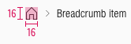
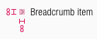

<AlertInfo alertHeadline="Modifiable">
Please ensure to comply with the corporate identity. A detailed list what can be modified can be found [here](#what-can-be-modified).
</AlertInfo>

# Breadcrumb

Indicate the current page’s location within a navigational hierarchy.

It is positioned near the header and is used primarily as a visual display to the customer, but is still interactive.

---

## Recommendations

- Don't show any breadcrumb on a tablet (portrait) and smartphone device.

---

## Overall styling

- The text-style always is **small**.
- The hover state changes the **mouse cursor into a link cursor (pointer).**
- Always use **house.svg** as home-icon and **arrow-right.svg** as separator.

| Types | Attributes | Preview |
|---|---|---|
| Default / hover / active | text-color: basic-black   icon-color: basic-black |  |

---

## Spacing & Measurements

- If the breadcrumb is larger than the viewport it breaks in a second line.
- Normally, there are not more than 5 levels shown.

| Types | Attributes | Preview |
|---|---|---|
| Vertical spacing | margin: 4px|   |
| Horizontal spacing | padding: 8px |  |
| Size | home: 16x16px   separator: 8x8px |   |
| Width | result of the addition of all symbols |  |

---

## What can be modified?

- Override the text.
- Adjust the width of a single symbol according to the text.

### Our workflow in Sketch

- The breadcrumb is made up of the individual symbols from the fundamentals and from the kit.
- They add up seamlessly to each other.
- The text can be changed using the "Overrides"-function.
