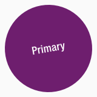
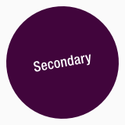

<AlertInfo alertHeadline="Modifiable">
Please ensure to comply with the corporate identity. A detailed list what can be modified can be found [here](#what-can-be-modified).
</AlertInfo>

# Bubble

The bubble component belongs - like [corner](../Corner/Corner.md), [frame](../Frame/Frame.md) and [marker](../Marker/Marker.md) - to the group of **flashes**.

Use the different flashes to emphasize messages with a strong meaning.

---

## Recommendations

- All flash elements should be used sparingly to avoid overload.
- Please use the bubble only for a maximum text length of one to three lines.

---

## Overall styling

- The bubble has **no hover-** or **focus-state**.
- The text-style depends on the component and is always **bold**.
- The line-height is always **120%**.

---

## Variants

- The bubble element is available in different sizes, depending on the corresponding text-styles: **small-**, **basic-** and **large-bold**
- Please use the bubble that corresponds to the breakpoint, as there are different sizes available: **small**, **basic**, **large**.
- The bubble element is available in different colors, which are subcategorized into: **positive** and **negative**.

| Types | Attributes | Preview |
|---|---|---|
| Primary (positive) | text-color: basic-white background-color: brand-primary-base |  |
| Secondary (positive) | text-color: basic-white background-color: brand-secondary-base | |
| Info (positive) | text-color: basic-white background-color: brand-info-darker |  |
| Attention (negative) | text-color: basic-black background-color: brand-attention-base |  |

---

### Position

- The bubble element can be placed completely free in the layout.

---

### Spacing & Measurements

| Types | Attributes | Preview |
|---|---|---|
| Horizontal spacing | small: 16px basic: 24px large: 32px | |
| Vertical spacing | the text always gets vertically centered |  |
| Size (LG) | small: 112 x 112px basic: 160 x 160px large: 200 x 200px  |  |
| Size (MD-XS) | small: 96 x 96px basic: 144 x 144px large: 184 x 184px  |  |
| Angle | rotation: 10° | 

---

## What can be modified?

- Override the text.

### Our workflow in Sketch

- Use the "Overrides"-function to change the text.
- Use the "Overrides"-function to change the background-color via layer-styles (this is only available in the positive variant).
