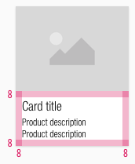

<AlertInfo alertHeadline="Modifiable">
Please ensure to comply with the corporate identity. A detailed list what can be modified can be found [here](#what-can-be-modified).
</AlertInfo>

# Card

A card can be used for almost every component possible. It can present a product or other stuff that should be displayed with a picture, text and description.

The card is a basic component which can be combined with other components (e.g.: priceboxes, ribbons, availabilities, etc).

---

## Recommendations

- Ideally, the title should be single-line or a maximum of two lines.
- The look of the default card is not mandatory. We only deliver a default card that can be modified to your projects needs.
- Change the text styles for your project needs but please stick to the given [text styles](../../General/Typography/Typography.md) of CAKE.

---

## Overall styling

- The text style of the title is [basic](../../General/Typography/Typography.md#basic).
- The text style of the description is [small](../../General/Typography/Typography.md#small).
- The line-height is **120%**.
- The image ratio always is **4:3**.
- Every state uses the **shadow-default**.
- The height of the white area depends on the content and the additional components shown.
- All widths are fixed and aligned to the layout grid of the breakpoints.
- The width of the component is divisible by 8 and equal to the image-width.

| Types | Attributes | Preview |
|---|---|---|
| Default | text-color: basic-black   background-color: basic-white |  |
| Hover / focus | text-color: basic-black, underlined   background-color: basic-white   image overlay: basic-white with 50% opacity |  |

---

## Spacing & Measurements

| Types | Attributes | Preview |
|---|---|---|
| Image size | Always ratio 4:3 |  |
| Overall   Padding | LG - SM: 16px   XS: 8px|  |
| Padding   title to description| LG - SM: 8px   XS: 4px |   |

---

## Position

| Types | Attributes | Preview |
|---|---|---|
| LG | 4 tiles with width over 3 columns |  |
| MD | 4 tiles with width over 3 columns | |
| SM | 2 tiles with width over 2 columns |  |
| XS | 2 tiles with width over 1 column |  |

---

## What can be modified?

- Override the text and image.
- Adjust the height.
- Change the text to a two line scenario.
- Modify tiles to your project needs by adding other symbols to the product tile (i.e. ribbons, priceboxes, product ratings, badges).

### Our workflow in Sketch

- To change the text or image use the "Overrides"-function.
- Place additional elements like the pricebox element on top of the product tile and resize the height.
