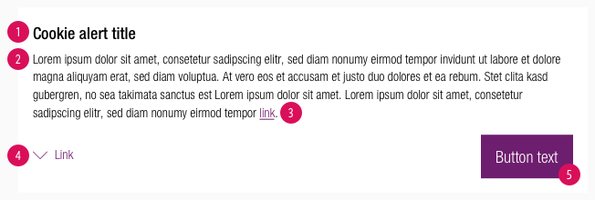
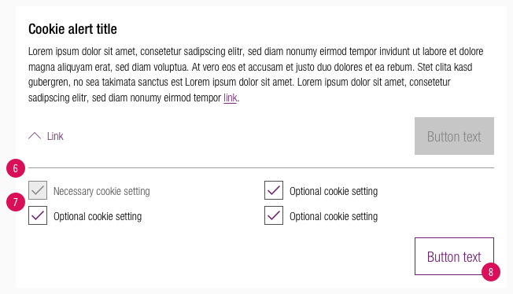
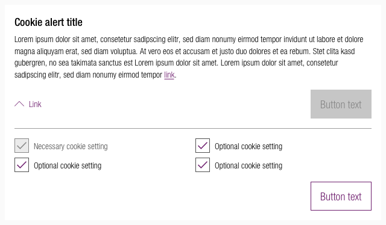
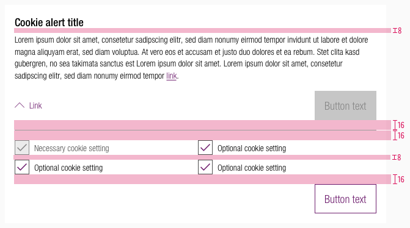
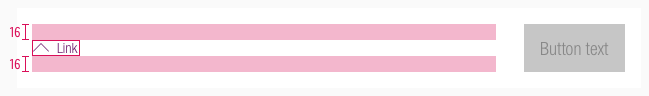
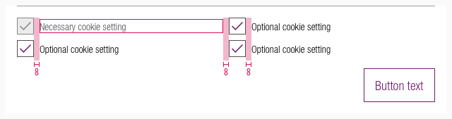
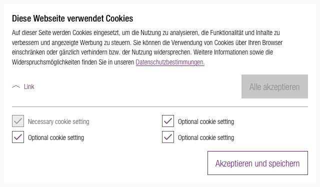

<AlertInfo alertHeadline="Modifiable">
Please ensure to comply with the corporate identity. A detailed list what can be modified can be found [here](#what-can-be-modified).
</AlertInfo>

# Cookie Alert

Visitors of websites are informed about the legal requirements or privacy policy.

They have to agree to the cookie settings of websites to visit and interact with them.

---

## Recommendations

- Give the user clear button labels to select the cookie settings.
- If the cookie alert is extended only one button is active. The other button changes to the disabled state.
- Change the cookie settings regarding the legal requirements of your country.

---

## Elements

- The cookie alert has a modular structure.

### Collapsed

- It contains a text with a possible link to further infos.
- It uses a link with icon to extend the cookie box.
- It shows a button to confirm the cookie settings immediately.

| Types | Preview |
|---|---|
| 1. **Headline** 2. Legal information **default text** 3. **Link** to information on website 4. **Link** to open more cookie settings 5. **Button** to accept default settings |  |

### Extended

- It uses a divider to separate itself from the content above.
- It contains checkboxes for settings.
- It shows the primary button in a disabled state.
- It shows a secondary button to confirm and save the user's individual settings.

| Types | Preview |
|---|---|
| 6. **Divider** 7. **Checkboxes** for individual settings 8. **Button** to accept individual settings |  |

---

## Overall styling

- The headline has the text-style [headline 5](../../General/Typography/Typography.md#headlines-headline-level-5).
- The text, link and checkboxes have the text-style [small](../../General/Typography/Typography.md#small).
- The line-height is set to **default**.
- Text-color is **basic-black**.
- The links (with icon) follow the rules of our [link description](../../General/Link/Link.md).
- Background-color is **basic-white**.
- The buttons are **positive-primary**, **-secondary** and **-disabled** style.
- The divider has a height of **1px** an comes in **gray-light**.
- The overlay uses the definition of [overlay description](../../General/Effect/Effect.md#overlays).
- The **height** depends on the content and the additional components shown.

---

## Spacing & measurements

- The overall padding is **16px**.

| Types | Attributes | Preview |
|---|---|---|
| Vertical spacing | headline to text: 8px   space to divider: 16px   space checkboxes: 8px   checkboxes to button: 16px |  |
| Alignment | the link and button are aligned horizontally to each other |  |
| Horizontal spacing checkboxes | 8px |  |

---

## Position

- The cookie alert is placed in the center of the screen.
- The [overlay](../../General/Effect/Effect.md#overlays) covers the complete website.
- The user can only interact with the website after confirming the cookie settings.

---

## Example with content

- Take a look at an example with real content for a better understanding.
- There is always only one button active.
- Always consult your legal office if the content is conform with the legal requirements of your country.

---

## What can be modified?

- Override the text.
- Change the status of the buttons and checkboxes.

### Our workflow in Sketch

- Use the „Overrides“-function to edit the content or to change the status of the button or checkboxes.
