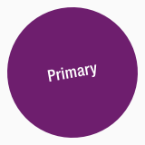
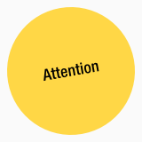
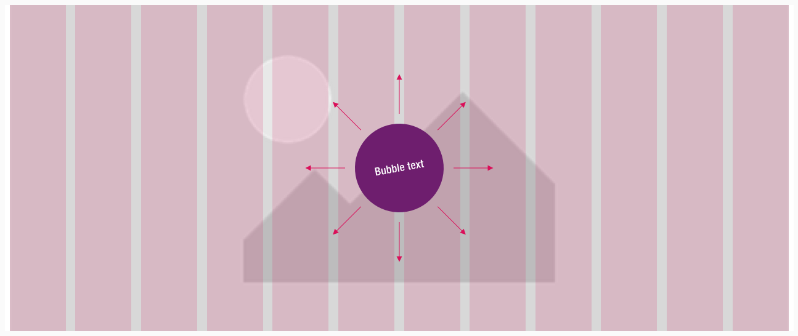
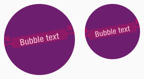
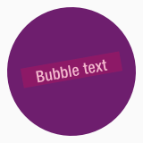
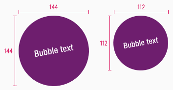
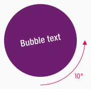

<AlertInfo alertHeadline="Modifiable">
Please ensure to comply with the corporate identity. A detailed list what can be modified can be found [here](#what-can-be-modified).
</AlertInfo>

# Bubble

The bubble component belongs - like [corner](../Flash-Corner/Flash%20-%20Corner.md), [frame](../Flash-Frame/Flash%20-%20Frame.md) and [marker](../Flash-Marker/Flash%20-%20Marker.md) - to the group of **flashes**.

Use the different flashes to emphasize messages with a strong meaning.

---

## Recommendations

- All flash elements should be used sparingly to avoid overload.
- Please use the bubble only for **one to three words**. 
- When entering text, mobile view (MD-XS) should be taken into consideration first.
- Longer text becomes multiline up to a maximum number of 2 lines (MD-XS) or 3 lines (LG).
- Too long text is truncated with ellipsis.

---

## Overall styling

- The text-style depends on the component and is always [basic bold](../../General/Typography/Typography.md#basic-bold).
- The line-height is always **120%**.
- The bubble has **no hover-** or **focus-state**.

---

## Variants

- The bubble element is available in different colors, which are subcategorized into: **positive** and **negative**.

| Types | Attributes | Preview |
|---|---|---|
| Primary (positive) | text-color: basic-white background-color: brand-primary-base |  |
| Attention (negative) | text-color: basic-black background-color: brand-attention-base |  |

---

### Position

- The bubble element can be placed completely free in the layout.

---

### Spacing & Measurements

| Types | Attributes | Preview |
|---|---|---|
| Horizontal spacing | padding: 16px (LG) padding: 8px (MD-XS) | |
| Vertical spacing | the text always gets optically, vertically centered |  |
| Size | LG: 144 x 144px MD-XS: 112 x 112px |  |
| Angle | rotation: 10° | 

---

## What can be modified?

- Override the text.
- Modify bubble to your project needs by resizing the symbol proportional.

### Our workflow in Sketch

- Use the "Overrides"-function to change the text.
- Use the "Overrides"-function to change the background-color via layer-styles (this is only available in the positive variant).
- Detach the symbol for resize the element to your needs.
