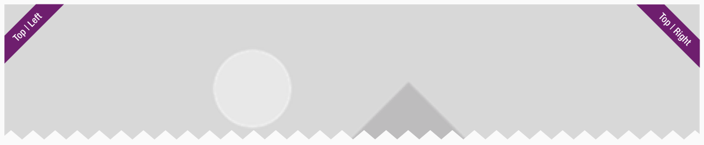
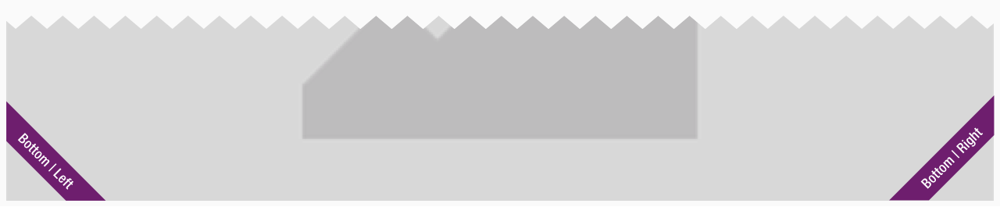
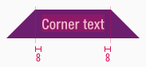
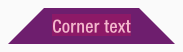
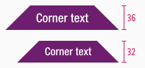
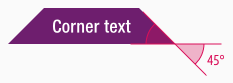

<AlertInfo alertHeadline="Modifiable">
Please ensure to comply with the corporate identity. A detailed list what can be modified can be found [here](#what-can-be-modified).
</AlertInfo>

# Corner

The corner component belongs - like [bubble](../Flash-Bubble/Flash%20-%20Bubble.md), [frame](../Flash-Frame/Flash%20-%20Frame.md) and [marker](../Flash-Marker/Flash%20-%20Marker.md) - to the group of **flashes**.

Use the different flashes to emphasize messages with a strong meaning.

---

## Recommendations

- All flash elements should be used sparingly to avoid overload.
- Please use the corner only for a single line text or just for one word.

---

## Overall styling

- The text-style depends on the component and is always [basic bold](../../General/Typography/Typography.md#basic-bold).
- The line-height is always **120%**.
- The corner has **no hover-** or **focus-state**.

---

## Variants

- The corner element is available in different colors, which are subcategorized into: **positive** and **negative**
- There is an additional separation into **top** and **bottom** due to the readability of the text.

| Types | Attributes | Preview |
|---|---|---|
| Primary (positive) | text-color: basic-white background-color: brand-primary-base |  |
| Secondary (positive) | text-color: basic-white background-color: brand-secondary-base | |
| Info (positive) | text-color: basic-white background-color: brand-info-darker |  |
| Attention (negative) | text-color: basic-black background-color: brand-attention-base |  |

---

### Position

| Types | Attributes | Preview |
|---|---|---|
| Top | This symbol has to be placed in the **top-left** or **-right** corner of any component. |  |
| Bottom | This symbol has to be placed in the **bottom-left** or **-right** corner of any component. |  |

---

### Spacing & Measurements

- The width of the corner component depends on the content.

| Types | Attributes | Preview |
|---|---|---|
| Horizontal spacing | padding: 8px | |
| Vertical spacing | the text is always optically vertically centered |  |
| Height | LG: 36px MD-XS: 32px  |  |
| Angle | inner angle: 45° | 

---

## What can be modified?

- Override the text.
- Modify corner to your project needs by resizing the symbol.

### Our workflow in Sketch

- Use the "Overrides"-function to change the text.
- Use the "Overrides"-function to change the background-color via layer-styles (this is only available in the positive variant).
- The symbol has to be rotated by 45 degrees for the desired position.
- Detach the symbol for resize the element to your needs.
