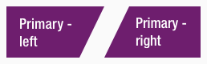
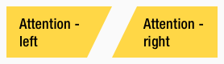
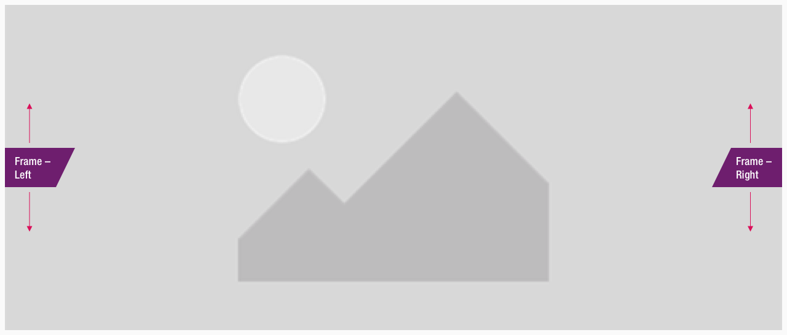
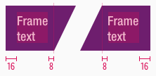
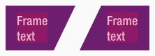
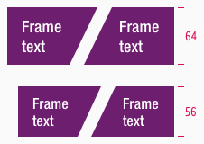
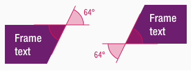

<AlertInfo alertHeadline="Modifiable">
Please ensure to comply with the corporate identity. A detailed list what can be modified can be found [here](#what-can-be-modified).
</AlertInfo>

# Frame

The corner component belongs - like [bubble](../Flash-Bubble/Flash%20-%20Bubble.md), [corner](../Flash-Corner/Flash%20-%20Corner.md) and [marker](../Flash-Marker/Flash%20-%20Marker.md) - to the group of **flashes**.

Use the different flashes to emphasize messages with a strong meaning.

---

## Recommendations

- All flash elements should be used sparingly to avoid overload.
- Please use the frame only for **one to three words**. 
- When entering text, mobile view (MD-XS) should be taken into consideration first.
- The frame grows with the content up to a max-width of 50% of the parent element.
- Too long text is truncated with ellipsis.

---

## Overall styling

- The text-style depends on the component but is always [basic bold](../../General/Typography/Typography.md#basic-bold).
- The line-height always is **120%**.
- The frame has **no hover-** and **focus-state**.

---

## Variants

- The frame element is available in different colors, which are subcategorized into: **positive** and **negative**.
- There is an additional separation into **left** and **right** due to the positioning of the symbol.

| Types | Attributes | Preview |
|---|---|---|
| Primary (positive) | text-color: basic-white background-color: brand-primary-base |  |
| Attention (negative) | text-color: basic-black background-color: brand-attention-base |  |

---

### Position

- The frame symbol can either be placed on the **left** or **right** side of a component.
- The correct position is determined by the symbol name.

---

### Spacing & measurements

- The width of the corner component depends on the content.

| Types | Attributes | Preview |
|---|---|---|
| Horizontal spacing | padding: 16px / 8px (left) padding: 8px / 16px (right) | |
| Vertical spacing | the text is always optically vertically centered |  |
| Height | LG: 64px MD-XS: 56px  |  |
| Angle | inner angle: 64° | 

---

## What can be modified?

- Override the text.
- Modify frame to your project needs by resizing the symbol.

### Our workflow in Sketch

- Use the "Overrides"-function to change the text.
- Use the "Overrides"-function to change the background-color via layer-styles (this is only available in the positive variant).
- The width of the symbol has to be adjusted manually.
- Detach the symbol for resize the element to your needs.
