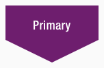
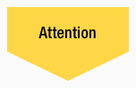
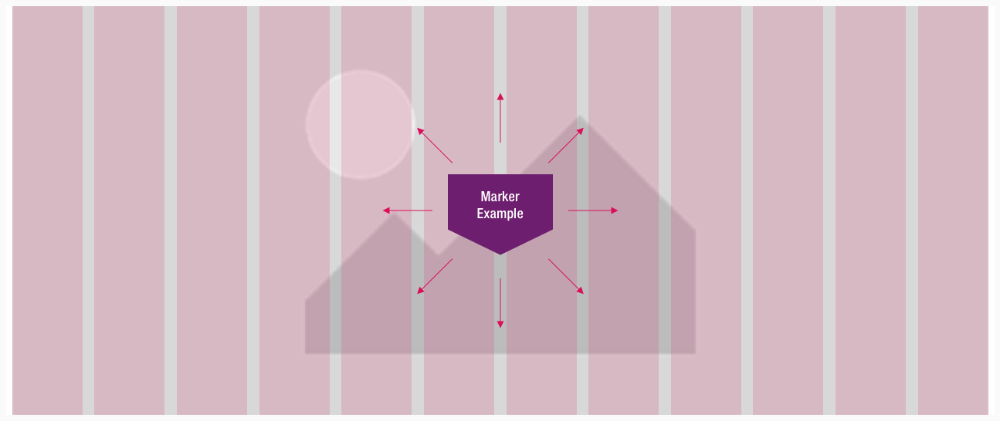
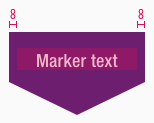
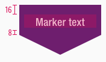
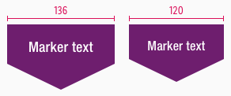
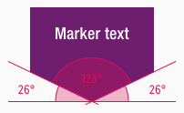

<AlertInfo alertHeadline="Modifiable">
Please ensure to comply with the corporate identity. A detailed list what can be modified can be found [here](#what-can-be-modified).
</AlertInfo>

# Marker

The marker component belongs - like [bubble](../Flash-Bubble/Flash%20-%20Bubble.md), [corner](../Flash-Corner/Flash%20-%20Corner.md) and [frame](../Flash-Frame/Flash%20-%20Frame.md) - to the group of **flashes**.

Use the different flashes to emphasize messages with a strong meaning.

---

## Recommendations

- All flash elements should be used sparingly to avoid overload.
- Please use the marker only for **one to three words**. 
- When entering text, mobile view (MD-XS) should be taken into consideration first.
- When entering longer text, the element grows only in height and becomes multiline up to a maximum number of 4 lines (LG-XS).
- Too long text is truncated with ellipsis.

---

## Overall styling

- The text-style depends on the component and is always [basic bold](../../General/Typography/Typography.md#basic-bold).
- The line-height is always **120%**.
- The marker has **no hover-** or **focus-state**.

---

## Variants

- The marker element is available in different colors, which are subcategorized into: **positive** and **negative**.

| Types | Attributes | Preview |
|---|---|---|
| Primary (positive) | text-color: basic-white background-color: brand-primary-base |  |
| Attention (negative) | text-color: basic-black background-color: brand-attention-base |  |

---

### Position

- The marker element can be placed completely free in the layout.

---

## Spacing & measurements

| Types | Attributes | Preview |
|---|---|---|
| Horizontal spacing | 8px | |
| Vertical spacing | padding-top: 16px |  |
| Width | LG: 136px MD-XS: 120px |  |
| Angle | inner angle: 128° outer angle: 26° | 

---

## What can be modified?

- Override the text.
- Modify marker to your project needs by resizing the symbol.

### Our workflow in Sketch

- Use the "Overrides"-function to change the text.
- Use the "Overrides"-function to change the background-color via layer-styles (this is only available in the positive variant).
- Detach the symbol for resize the element to your needs.
