<AlertInfo alertHeadline="Modifiable">
Please ensure to comply with the corporate identity. A detailed list what can be modified can be found [here](#what-can-be-modified).
</AlertInfo>

# Footer

Use the footer to help the customer with additional information and navigation at the bottom of a website.

It only exists in combination with our [sticky bar](../Sticky%20bar/Sticky%20bar.md) and has a fixed order that must be followed at the end of each web page.

---

## Recommendations

- Keep the footer as short as possible. Do not load it with unnecessary information. The customer is interested in a first glance.
- Ideally, important links will be opened via a new window or a tab in the browser.

---

## Elements

The default footer contains the following elements:

1. Headline
1. Main-Navigation
1. Divider
1. Meta-Navigation
1. Background

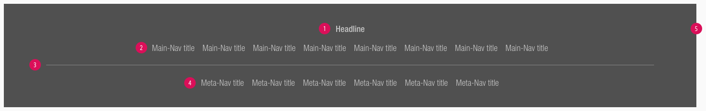

### Usage of elements

| Headline | Main-Navigation | Meta-Navigation |
|---|---|---|
|This element is not absolutely necessary for the setup of a footer, unless you want to title or organize your main-navigation categories.|Use it to show a summary of all possible links or menus on a SCHWARZ website (i.e. sitemap, wishlist, shopping cart, account, ...).|For information, such as legal (imprint, terms and conditions, data protection, ...) or contact, which must be placed on a website.|

---

## Overall styling

- The background-color always is **gray-dark**.
- The divider width depends on the breakpoint but always has a **height of 1px** and the color **gray-base**.
- The line-height is set to **default**.

### Default

| Types | Attributes | Preview |
|---|---|---|
| Headline | text-style: [headline 5](../../General/Typography/Typography.md#headlines-headline-level-5) text-color: gray-lighter |  |
| Main-Navigation | text-style: [basic](../../General/Typography/Typography.md#basic) text-color: gray-lighter | 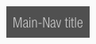 |
| Meta-Navigation | text-style: [basic](../../General/Typography/Typography.md#basic) text-color: gray-lighter | 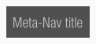|

### Hover, focus, active

| Types | Attributes | Preview |
|---|---|---|
| Headline | For this element there is **no hover, focus, active** status. | --- |
| Main-Navigation | text-color: basic-white text gets underlined | |
| Meta-Navigation | text-color: basic-white text gets underlined |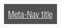|

---

## Spacing & measurements

### Complete

- The background expands over the whole screen.

| Types | Attributes | Preview |
|---|---|---|
| Width | 1264px (LG)  944px (MD)  584px (SM)  304px (XS) |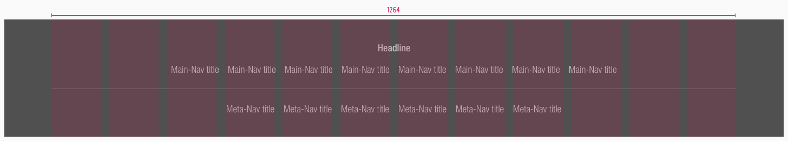 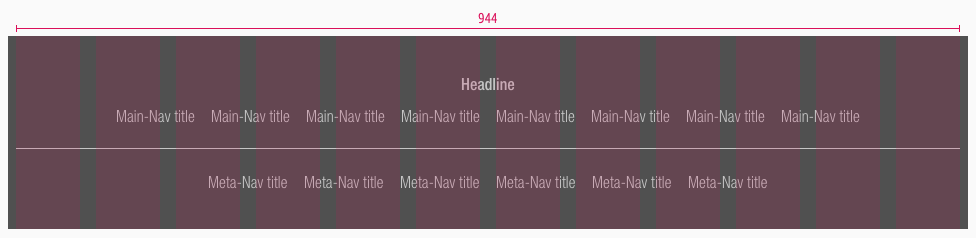 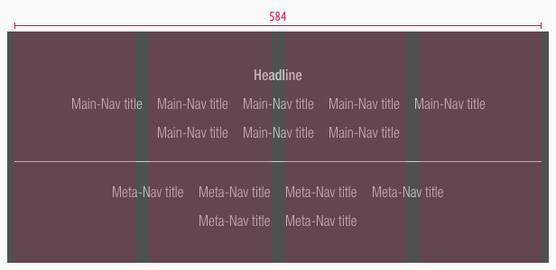 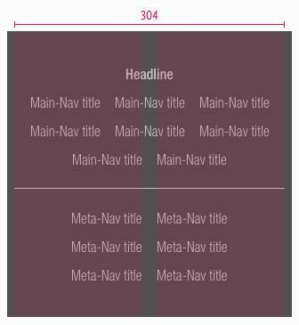|
| Horizontal spacing | padding-top/-bottom: 32px margin: 16px |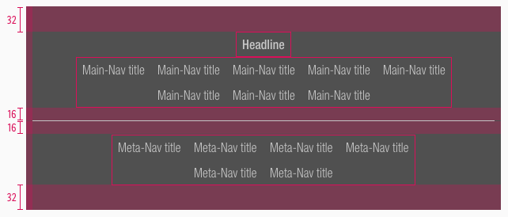|
| Vertical spacing | 8px ||

### Elements

| Types | Attributes | Preview |
|---|---|---|
| Horizontal spacing | padding: 8px | 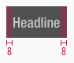 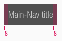 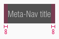 |
| Vertical spacing | the text gets horizontally centered | 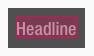 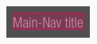 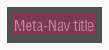 |

---

## Variants

- Alternatively, the footer can be arranged in columns instead of rows.
- This happens only for the desktop and tablet (landscape) breakpoint and if there are 3 rows or more in the main-navigation.
- The main-navigation always extends over 2 columns including gutter and can add itself infinitely downwards.

| 3 columns | 4 colums |
|---|---|
|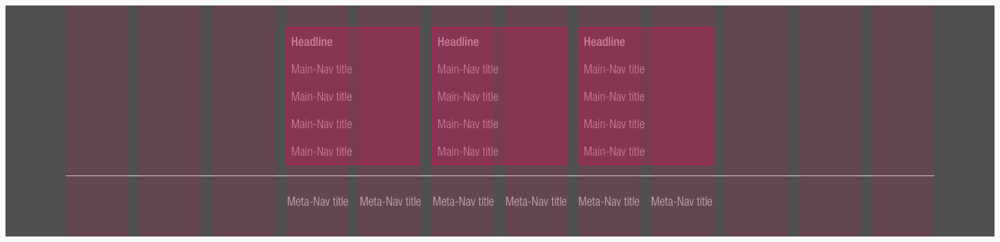|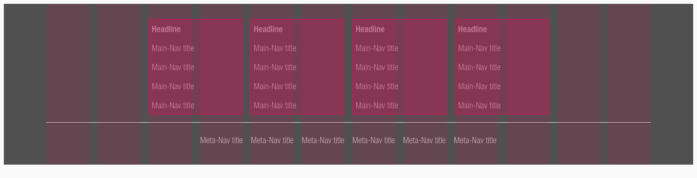|

---

## Example

 

 ---

## What can be modified?

- Override the text.
- Adjust the width of single symbols according to the text.
- Add rows or columns.
- Switch between the two possible layouts (vertically or horizontally).
- Modify footers for your project needs by adding other symbols (i.e. input fields, badges, buttons, …).

### Our workflow in Sketch

- Use the „Overrides“-function to edit the content of the symbols:
  - main-navigation
  - meta-navigation
  - headline
