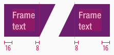
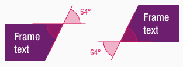

<AlertInfo alertHeadline="Modifiable">
Please ensure to comply with the corporate identity. A detailed list what can be modified can be found [here](#what-can-be-modified).
</AlertInfo>

# Frame

The corner component belongs - like [bubble](../Bubble/bubble.md), [corner](../Corner/Corner.md) and [marker](../Marker/Marker.md) - to the group of **flashes**.

Use the different flashes to emphasize messages with a strong meaning.

---

## Recommendations

- All flash elements should be used sparingly to avoid overload.
- Please use the corner only for a maximum text length of two lines.

---

## Overall styling

- The frame has **no hover-** and **focus-state**.
- The text-style depends on the component but is always **bold**.
- The line-height always is **120%**.

---

## Variants

- The frame element is available in different sizes, depending on the corresponding text-styles: **small-**, **basic-** and **large-bold**
- Please use the frame that corresponds to the breakpoint, as there are different sizes available: **small**, **basic**, **large**.
- The frame element is available in different colors, which are subcategorized into: **positive** and **negative**
- There is an additional separation into **left** and **right** due to the positioning of the symbol.

### Left

| Types | Attributes | Preview |
|---|---|---|
| Primary (positive) | text-color: basic-white background-color: brand-primary-base |  |
| Secondary (positive) | text-color: basic-white background-color: brand-secondary-base | |
| Info (positive) | text-color: basic-white background-color: brand-info-darker |  |
| Attention (negative) | text-color: basic-black background-color: brand-attention-base |  |

### Right

| Types | Attributes | Preview |
|---|---|---|
| Primary (positive) | text-color: basic-white background-color: brand-primary-base |  |
| Secondary (positive) | text-color: basic-white background-color: brand-secondary-base | |
| Info (positive) | text-color: basic-white background-color: brand-info-darker |  |
| Attention (negative) | text-color: basic-black background-color: brand-attention-base |  |

---

### Position

- The frame symbol can either be placed on the **left** or **right** side of a component.
- The correct position is determined by the symbol name.

---

### Spacing & Measurements

- The width of the corner component depends on the content.

| Types | Attributes | Preview |
|---|---|---|
| Horizontal spacing | padding: 16px / 8px (variant: right) padding: 8px / 16px (variant: right) | |
| Vertical spacing | the text is always vertically centered |  |
| Height (LG) | small: 48px basic: 64px large: 80px  |  |
| Height (MD-XS) | small: 48px basic: 56px large: 64px  |  |
| Angle | inner angle: 64° | 

---

## What can be modified?

- Override the text.

### Our workflow in Sketch

- Use the "Overrides"-function to change the text.
- Use the "Overrides"-function to change the background-color via layer-styles (this is only available in the positive variant).
- The width of the symbol has to be adjusted manually.
