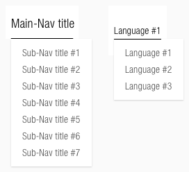
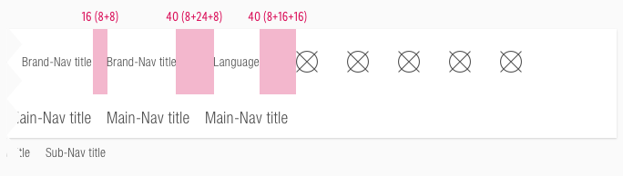
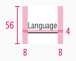
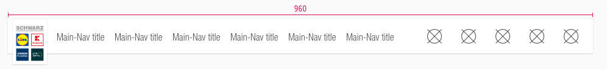
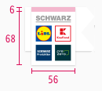
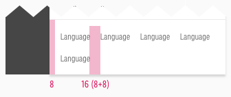
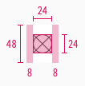
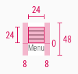
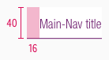

<AlertInfo alertHeadline="Modifiable">
Please ensure to comply with the corporate identity. A detailed list what can be modified can be found [here](#what-can-be-modified).
</AlertInfo>

# Header

The header is one of the essential components to create brand awareness.

The appearance demonstrates visitors that they are on a SCHWARZ page now. Its strongest supporting element is the SCHWARZ enterprise logo.

---

## Recommendations

- Keep the globally known SCHWARZ enterprise logo in the header.
- Try to display all navigation items with one short and concise keyword.
- Don't show more than five user-navigation elements (including the search icon in desktop and tablet).
- Please implement a search-function icon as the first user-navigation element from the right.

---

## Elements

- The structure of the header is **modular**.
- It is a group of symbols and typography from the SCHWARZ Fundamentals and SCHWARZ Web Kit.
- If you combine the individual elements in Sketch, you get the header in various forms and for each breakpoint.
- There is a **collapsed on-scroll layout** for our desktop and tablet (landscape) breakpoints.
- There is a separate header layout for tablets (portrait) and smartphones that opens a dropdown menu with the main- and sub-navigation over a burger-menu icon.
- The header contains the **logo**, **typography: main-, sub-, brand-** and **user-navigation**, as well as **colors** and **shadows**.

### Desktop & tablet landscape (LG & MD)

#### Extended

#### Collapsed: Main

#### Collapsed: Sub

1. Logo
1. Brand-navigation
1. Language
1. User-navigation
1. With integrated search
1. Main-navigation
1. Sub-navigation

### Tablet portrait & smartphone (SM & XS)

1. Logo
1. User-navigation
1. Burger-menu
1. Overlay
1. Search field (if it exists)
1. Main-navigation
1. Sub-navigation
1. Brand-navigation
1. Language
1. Dividers
1. Flyout

---

## Overall styling

- The **letter spacing** of every character is **0.2px**.
- The line-height of every text is **120%**.
- The header comes with a background-color in **basic-white**.
- It uses the **shadow-default**.
- The dividers in tablets (portrait) and smartphones have a **1px thickness** and use **gray-lightest** as color.
- The sub-navigation is positioned on the websites background but belongs to the complete header component.
- The search-field uses our [input-field](../Form/Form.md#input-field) states with the **"magnifier.svg"** as icon.
- Every text is **horizontally** aligned to the height.

---

## Logo

- The Logo comes in different sizes depending on:
  - the device
  - the extended or collapsed (on-scroll) mode for desktop and tablet (landscape).
- It is placed on a supporting area in **basic-white** that uses the **shadow-default**.
- Please regard the [logo extension](../../General/Logo/Logo.md#extension) description because of the logos position close to the screen border.

---

## Brand-navigation

- Some SCHWARZ sub-brands have special pages to present their company (e.g. Twogo, Dieter Schwarz Stiftung, …).
- The text-style is [small](../../General/Typography/Typography.md#small).
- The indicator is displayed only in the **hover/focus** state.
- The **length** of the indicator is based on the **entered text**.
- A click on this navigation item opens a new tab in the user's browser.

| Types | Attributes | Preview |
|---|---|---|
| Default | text-color: gray-dark ||
| Hover / focus | text-color: basic-black indicator: basic-black | |

---

## Language

- This selection is required by countries that offer a SCHWARZ sub-brand website in different languages.
- The text-style is [small](../../General/Typography/Typography.md#small).
- The default state always shows the current language. It changes to another language after a new selection.

| Types | Attributes | Preview |
|---|---|---|
| Default | text-color: gray-dark ||
| Hover / focus | text-color: basic-black indicator: basic-black ||

---

## Main- & sub-navigation

- There are different types of usage for each section of the navigation.
- Use the main-navigation for main topics that the SCHWARZ sub-brand has to offer.
- Use the sub-navigation if a main topic has subitems.
- The sub-navigation is only displayed if the main-navigation is active.
- The indicator is displayed in a **different color** for the **hover/focus** or **active** state.
- The **length** of the indicator is based on the **entered text**.
- Its position is at the bottom of the element.

### Overall styling (LG & MD)

- The text-style for main-navigation is [basic](../../General/Typography/Typography.md#basic).
- The line-height is set to **default**.

### Extended

- The text-style for sub-navigation is [small](../../General/Typography/Typography.md#small).

| Types | Attributes | Preview |
|---|---|---|
| Default | text-color: gray-dark |  |
| Hover / focus | text-color: basic-black indicator: basic-black |  |
| Active | text-color: brand-primary-base indicator: brand-primary-base |  |

### Collapsed

- The text-style for sub-navigation changes to [basic](../../General/Typography/Typography.md#basic).

| Types | Attributes | Preview |
|---|---|---|
| Default | text-color: gray-dark |  |
| Hover / focus | text-color: basic-black indicator: basic-black |  |
| Active | text-color: brand-primary-base indicator: brand-primary-base |  |

### Overall styling (SM & XS)

- The text-style for main-navigation is [basic](../../General/Typography/Typography.md#basic).
- The text-style for sub-navigation is [small](../../General/Typography/Typography.md#small).
- The line-height is set to **default**.
- The **length** of the indicator starts at beginning of the component.
- Its position is at the bottom of the element.

| Types | Attributes | Preview |
|---|---|---|
| Default | text-color: gray-dark | |
| Hover / focus | text-color: basic-black indicator: basic-black |  |
| Active | text-color: brand-primary-base indicator: brand-primary-base |   |

---

## User-navigation

- This area is for user guidance with the support of icons.
- The most important elements for the user should be placed here (e.g. login, account, search …).
- It uses the [badge-addon](../Badge/Badge.md#addon) to display a counter.

| Types | Attributes | Preview |
|---|---|---|
| Default / active | icon-color: gray-dark |  |
| Hover / focus | icon-color: basic-black |  |

---

## Burger-menu

- Use this element only for tablets (portrait) and smartphones to demonstrate all navigation elements.
- In contrast to the user-navigation, a **"menu"-text** is shown.
- The text-style is always [small](../../General/Typography/Typography.md#small).
- It uses our **"bars-horizontal.svg"** icon to display a burger-menu.
- The burger changes to our **"cross.svg"** icon as a close-function.

| Types | Attributes | Preview |
|---|---|---|
| Default | text-color: gray-dark icon-color: gray-dark |  |
| Hover / focus | text-color: basic-black icon-color: basic-black |  |
| Active | text-color: gray-dark icon-color: gray-dark |  |

---

## Flyout

- The main-navigation and language selection on desktop and tablet (landscape) show a flyout **on hover** with all possible options.
- It comes with a background-color of **basic-white**.
- It uses **shadow-default**.
- It is located directly under the indicator of the hover state.

| Types | Attributes | Preview |
|--|---|---|
| Default | text-color: gray-dark |  |
| Hover/focus | text-color: basic-black indicator: basic-black |  |

---

## Spacing & measurements

- This section shows the different spacings of the desktop, tablet and mobile elements included in the header.

### Desktop & tablet landscape (LG & MD)

- All the spacing for these breakpoints and extended or collapsed mode are identical.
- Only the **height** and **width** of the used components are different.

#### Spacing

| Types | Attributes | Preview |
|---|---|---|
| Content | padding-left/-right: 8px |  |
| Brand-navigation | padding-left/-right: 16px (8+8) margin-right: 40px (8+24+8) / (8+16+16) |  |
| User-navigation | padding: 32px (16+16) |  |
| Main-navigation | offset: 24px (16+8) padding: 16px (8+8) |  |
| Sub-navigation | offset: 24px (16+8) padding: 16px (8+8) |  |
| Flyout | padding: 8px | 

#### Measurements

##### Extended

| Types | Attributes (LG / MD) | Preview |
|---|---|---|
| Height | complete: 159px / 130px upper-section: 72px / 56px main-navigation: 48px / 40px sub-navigation: 40px / 24px |   |
| Width | complete: 1280px / 960px |   |
| Logo | size: 120x147px / 98x120px extension: 12px / 10px |  |
| Brand-navigation | padding: 8px height: 72px / 56px margin-bottom: 4px indicator: 1px  | |
| Language | padding: 8px height: 72px / 56px margin-bottom: 4px indicator: 1px |  |
| User-navigation | padding: 16px height: 72px / 56px icon-size: 24x24px |   |
| Main-navigation | padding: 8px height: 48px / 40px indicator: 1px |  |
| Sub-navigation | padding: 8px height: 32px / 24px indicator: 1px |  |
| Flyout option | padding: 8px height: 32px / 24px margin-bottom: 4px indicator: 1px |  |

##### Collapsed

| Types | Attributes (LG / MD) | Preview |
|---|---|---|
| Height | complete: 106px / 74px main-, sub- & user-navigation: 72px / 56px|   |
| Width | complete: 1280px / 960px |   |
| Logo | size: 80x98px / 56x68px extension: 8px / 6px |  |
| Main-navigation | padding: 8px height: 72px / 56px indicator: 1px |  |
| Sub-navigation | padding: 8px height: 72px / 56px indicator: 1px |  |
| User-navigation | padding: 16px height: 72px / 56px icon-size: 24x24px |   |

### Tablet portrait & smartphone (SM & XS)

#### Spacing

- All the spacing for these breakpoints are identical.

| Types | Attributes (SM / XS) | Preview |
|---|---|---|
| Content | padding: 8px |  |
| Dropdown | padding-top/-bottom: 16px margin: 8px | 
| User-navigation | padding: 16px (8+8) |  |
| Brand-navigation | offset: 8px padding: 16px (8+8) |  |
| Language | offset: 8px padding: 16px (8+8) | 

#### Measurements

| Types | Attributes (SM / XS) | Preview |
|---|---|---|
| Height | complete: 64px user-navigation: 48px search-field: 72px main-& sub-navigation: depends on content brand-navigation: depends on content language: depends on content |  |
| Width | width: 600px / 320px flyout: 320px / 256px |  |
| Logo | size: 48x59px extension: 5px  |  |
| User-navigation | padding: 8px height: 48px icon-size: 24x24px |  |
| Burger-menu | padding: 8px margin-bottom: 0px height: 48px icon-size: 24x24px | |
| Main-navigation | width: depends on content padding-left: 16px height: 40px indicator: 1px |  |
| Sub-navigation | width: depends on content padding: 32px height: 32px indicator: 1px |  |
| Brand-navigation | padding: 8px height: 32px margin-bottom: 2px indicator: 1px ||
| Language | padding: 8px height: 32px margin-bottom: 2px indicator: 1px |  |

---

## Position

| Types | Attributes | Preview |
|---|---|---|
| Addon | padding-right: 4px (LG) padding-right: 8px (MD) padding-right: 0px (SM+XS) |  |

---

## Behavior

### On-scroll

- The header resizes in desktop and tablet (landscape) with an on-scroll effect - as given in our examples on the top of this description.
- There are two different behavior for the resizing depending on the navigation items shown.

### Main- & sub-navigation

- If **the first scroll-down** interaction is triggered, the whole header gets in its **collapsed** mode.
- If **the first scroll-up** interaction is triggered, the whole header gets in its **extended** mode.
- The animation of all elements starts with a global transition.
- If a sub-navigation exists all main-navigation items are hidden.
- Each menu item is clickable and the corresponding menu default page is loaded.
- If a menu item does not have a separate default page, the content of the first sub-nav page is displayed.

| Types | Preview |
|---|---|
| Main-navigation |  |
| Sub-navigation |  |

#### Recommendations

- We checked some settings for the transition that are given in the table below.

| Settings | Duration | Delay | CSS attribute | Bezier |
|---|---|---|---|---|
| Scroll down (Collapsed)| 0.6s | 0.15s | presets ease in & out | 0.64, 0.04, 0.35, 1 |
| Scroll up (Extended)| 0.4s | 0s | custom presets | 0.59, 0.06, 0.4, 0.95 |

### Overflow menu "More"

- The last main- or sub-navigation item is displayed as an overflow menu named "more..." if too many items should be presented than the possibility to show them.
- The keyword "more..." is only a recommended example and can be retitled to any appropriate term (i.e. "others…").
- The more menu is treated like a main-nav item. The items inside the overflow menu behave like sub-nav items.

### Flyout

- The main-navigation shows a flyout with all subitems **on hover** to grant a direct access for the user.
- Ends 40px from browser bottom edge or 8px from sticky bar.
- Maximal width is 33% of viewport width.
- Text breaks into multiple lines when maximal width is overreached.
- The alignment of the flyout depends on the positioned main-menu item.
- Therefore, the alignment can be left or right on the indicator.
- On mobile devices, the flyout is triggered on hold-tap and is visible until a sub-navigation is selected.
- The flyout **on focus** state is triggered by pressing Enter. To navigate through the elements, use the tab key or the up/down arrow on the keyboard.
- A flyout element is to be used exclusively in the main-nav.

| Types | Preview |
|--|---|
| Left |  |
| Right |  |

## Examples

- Clicking on the magnifier icon opens an active input-field that overlays the whole upper section (brand-, user-navigation and language selection) of the header.
- In collapsed mode, the main-navigation fades out completely and only the search field is shown.

---

## What can be modified?

- Override the text and icons.
- Adjust the width of single symbols according to the text.
- Adjust the height if you delete navigation sections (i.e. main- or sub-navigation).
- Modify headers for your project needs by deleting single symbols or special sections (i.e. language or user-navigation section).

### Our workflow in Sketch

- To individualize the header in your product you need to detach/unlink the complete symbol from the SCHWARZ CAKE UI Web kit.
- Fill it with realistic content and scale every single symbol to the right width or height.
