<AlertInfo alertHeadline="Modifiable">
Please ensure to comply with the corporate identity. A detailed list what can be modified can be found [here](#what-can-be-modified).
</AlertInfo>

# Pagination

Pagination is used to spread content or data over multiple pages.

It allows the user to jump to the respective pages by browsing.

---

## Recommendations

- Use the provided pagination as the simplest and smallest solution.
- The complete pagination can be placed either left, centered or right on a web page.
- It can also be placed above and below the page content.

---

## Overall styling

- The width depends on the number of shown digits or arrows.
- It is only scalable by adding up the digits or arrows.
- The text-style always is **basic**.
- The line-height is always **120%**.
- The text is centered within the textbox.
- The background is **basic-white**.
- Use „arrow-left“ and „arrow-right“ as icons.
- **Only arrows can be disabled!**

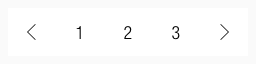

| Types | Attributes | Preview |
|---|---|---|
| Default | text-color: basic-black   icon-color: basic-black   background-color: basic-white | 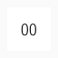 |
| Hover / focus / active | text-color: basic-white   icon-color: basic-white   background-color: brand-primary-base |  |
| Disabled | icon-color: gray-base   background-color: basic-white |  |

---

## Spacing & Measurements

### Spacing

| Types | Attributes | Preview |
|---|---|---|
| Digits | padding: 8px | 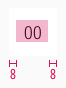 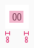 |
| Arrows | padding: 16px (LG)  padding: 12px (MD-XS) | 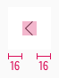 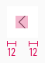 |

### Measurements

- The text is vertically centered.

| Types | Attributes | Preview |
|---|---|---|
| Height | LG: 48px   MD-XS: 40px | 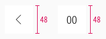  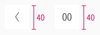 |
| Width | LG: 48px   MD-XS: 40px | 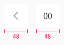  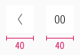 |
| Size | icon: 16x16px| 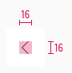 |

---

## Usage

- This section shows the usage of active arrows depending on the page shown to the user/customer.

| Types | Attributes | Preview |
|---|---|---|
| Right | more than one page  first index is shown |  |
| Both | more than one page   middle index is shown | 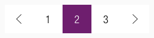 |
| Left | more than one page   last index is shown | |

---

## Variants

- You can create more or less digits.
- Just detach the symbol to define your own element.

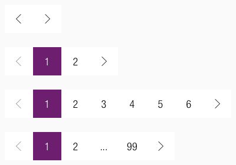

---

## What can be modified?

- Override the digits.
- Modify paginations for your project needs by adding or deleting single pagination symbols (i.e. like more digits or more arrows).

### Our workflow in Sketch

- Change the states of indexing and arrows using the "Overrides"-function.
