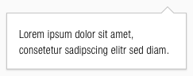
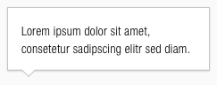
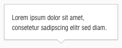
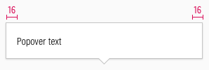
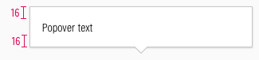

<AlertInfo alertHeadline="Modifiable">
Please ensure to comply with the corporate identity. A detailed list what can be modified can be found [here](#what-can-be-modified).
</AlertInfo>

# Popovers

This component is a pop-up box that appears when the user hovers over an element.

---

## General information

- **It appears on click for mobile devices.**
- To hide the pop-up box, the user simply clicks anywhere on the screen except for the popover itself.
- It is only displayed on demand and helps the user with additional detailed content, for example, important secondary information that are contextual.

---

## Recommendations

- **Rather use a short text in a popover than an image.**
- Use a popover to help the user complete tasks such as the ordering process or filling out a form.

---

## Overall styling

- The font-color is **basic-black**.
- The text-style is **small**.
- The background color is **basic-white**.
- The outline color is **gray-light**.
- The border has a **thickness of 1px**.
- It uses the **shadow-default**.
- The height and width depends on the content.
- The arrow on the popover can be set to different positions.

---

## Variants

### Top

- The arrow pointing to a component is at the top.

| Version | Preview |
| --- | --- |
| left |  |
| center |  |
| right |  |

### Bottom

- The arrow pointing to a component is at the bottom.

| Version | Preview |
| --- | --- |
| left |  |
| center |  |
| right |  |

### Left

- The arrow pointing to a component is on the left side.

| Version | Preview |
| --- | --- |
| top |  |
| center |  |
| bottom |  |

### Right

- The arrow pointing to a component is on the right side.

| Version | Preview |
| --- | --- |
| top |  |
| center |  |
| bottom |  |

---

## Spacing & Measurements

| Types | Attributes | Preview |
| --- | --- | --- |
| Horizontal spacing | padding: 16px |  |
| Vertical spacing | padding: 16px |  |
| Arrow size | width: 16px height: 8px |  |
| Offset | distance: 2px |   |

---

## What can be modified?

- Override the text.
- Modify popovers by changing the colors of background, outline and text to corresponding additional colors (i.e. like danger, success, info, …).

### Our workflow in Sketch

- Use the „Overrides“-function to select the required variant and to edit the content.
