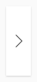
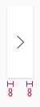
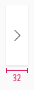
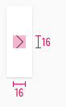

<AlertInfo alertHeadline="Modifiable">
Please ensure to comply with the corporate identity. A detailed list what can be modified can be found [here](#what-can-be-modified).
</AlertInfo>

# Slider Button

The slider button serves as a navigation element.

It can be used as a stand-alone or can be implemented into other components.

---

## Overall styling

- The icon can be adjusted to any arrow icon.

| Types | Attributes | Preview |
|---|---|---|
| Default | background-color: basic-white icon-color: basic-black |  |
| Hover / focus | background-color: brand-primary-base icon-color: basic-white |  |

---

## Spacing & measurements

| Types | Attributes | Preview |
|---|---|---|
| Horizontal spacing | padding: 8px |  |
| Width | fixed to 32px |  |
| Icon size | 16x16px |  |

---

## What can be modified?

- Override the arrows.
- Adjust the width and height.

### Our workflow in Sketch

- The icon in the slider-button can be changed via the "Overrides"-function.
