<AlertInfo alertHeadline="Modifiable">
Please ensure to comply with the corporate identity. [What can be modified](#what-can-be-modified)?
</AlertInfo>

# Sticky bar

This element indicates that the user is on a sub-brand page of SCHWARZ Enterprise. It also provides a "back-to-top" scrolling function.

It only exists in combination with our [footer](../Footer/Footer.md) and has a fixed order that must be followed at the end of each web page.

---

## Recommendations

- The sender badge of your sub-brand is available at [Schwarz brandmangement](mailto:brandmanagement@mail.schwarz).

---

## Elements

The sticky bar is built from the following elements:

1. Background
1. Sender badge
1. "to top" button

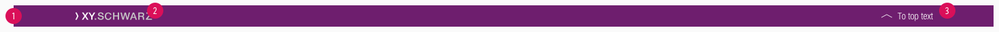

---

## Overall styling

- Text-style for the "to top"-button-text is always [small](../../General/Typography/Typography.md#small).
- The line height for the "to top"-button-text is **120%**.
- The background-color is always **brand-primary-base**.
- The icon is always "arrow-up.svg".

### States

- Only the "to top"-button has a hover/focus state.

| Types | Attributes | Preview |
|---|---|---|
| Default |  text-color: basic-white icon-color: basic-white | |
| Hover / focus | text-color: gray-lighter icon-color: gray-lighter| |

---

## Position

- It always sticks at the bottom of the viewport as the user scrolls up or down the page.

---

## Spacing & measurements

- The background expands over the whole screen.
- The sender badge's height scales to the complete element height depending on the viewport.
- Lock the sender badge's ratio to scale it.

| Types | Attributes | Preview |
|---|---|---|
| Width | 1264px (LG)  944px (MD)  584px (SM)  304px (XS) |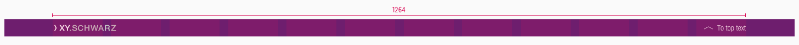 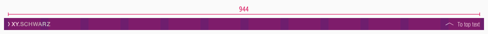 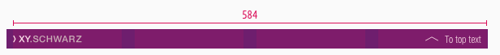 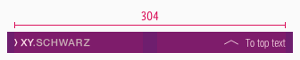|
| Height | 32px (LG)  24px (MD-XS) | 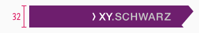 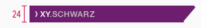 |
| Horizontal spacing (LG) | padding-left: 80px   padding-right: 88px | 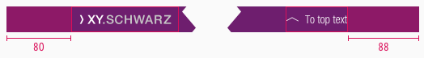 |
| Horizontal spacing (MD-XS) | padding-left: 0px padding-right: 8px  |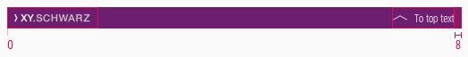 |
| Horizontal spacing (to top) | margin: 8px |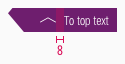 |
| Vertical spacing | All elements are vertically centered  |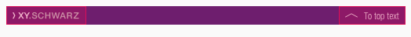|
| Icon size| 16 x 16px |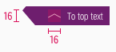|

---

## Example

 

 ---

## What can be modified?

- Adjust the width of symbols according to the breakpoint.

### Our workflow in Sketch

- Use the „Overrides“-function to edit the button text and it's state.
