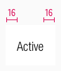

<AlertInfo alertHeadline="Modifiable">
Please ensure to comply with the corporate identity. A detailed list what can be modified can be found [here](#what-can-be-modified).
</AlertInfo>

# Tabs

A component to organize and navigate between related content at the same level of a website.

---

## Usage

- Use Tabs to organize similar content groups on the same page.
- This allows content to be viewed without having to navigate away from that page.
- The tabs are used to show the weekly offers on the start page.

---

## Overall styling

- Text-style is [basic](../../General/Typography/Typography.md#basic).
- The line-height is **120%**.

### Desktop & Tablet landscape (LG & MD)

- Dividers come in **gray-dark** as color with a **1px thickness**.
- The width is only scalable by adding up the different symbols (left, center or right).

| Types | Attributes | Preview |
|---|---|---|
| Active | text-color: basic-black background-color: basic-white |  |
| Hover / Focus | text-color: basic-white background-color: brand-primary-base  |  |
| Inactive | text-color: gray-dark background-color: gray-lighter |  |

#### Elements

- In combination, these individual elements are combined to the complete tab component.

| Types | Attributes | Preview |
|---|---|---|
| Left | divider: none |  |
| Center | divider: left  |  |
| Right | divider: left |  |

### Tablet portrait & Smartphone (SM & XS)

- There is **no inactive state**.
- The states can be switched via the slider-buttons.
- Styling of the slider-buttons can be found [here](../Slider%20button/Slider%20button.md).

|Types | Attributes | Preview |
|---|---|---|
| Active | text-color: basic-black background-color: basic-white |  |
| Hover / Focus | text-color: basic-black background-color: basic-white |  |

---

## Spacing & Measurements

### Desktop & Tablet landscape (LG & MD)

| Types | Attributes | Preview |
|---|---|---|
| Horizontal spacing | padding: 16px |  |
| Vertical spacing | padding: 16px |  |

### Tablet portrait & Smartphone (SM & XS)

| Types | Attributes | Preview |
|---|---|---|
| Horizontal spacing | padding: 8px |  |
| Vertical spacing | padding: 16px |  |

---

## What can be modified?

- Override the text.
- Override the arrows.
- Adjust the width of a single symbol according to the text.
- Modify tabs to your project needs by adding or deleting single tab symbols.

### Our workflow in Sketch

- Change the states of text, states and arrows using the "Overrides"-function.
