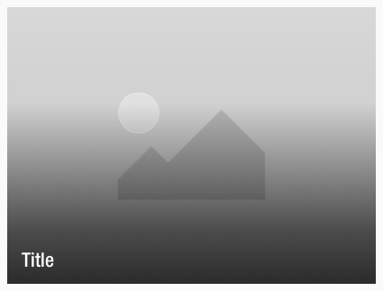
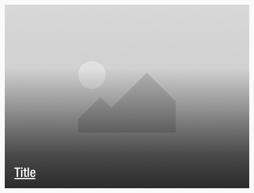
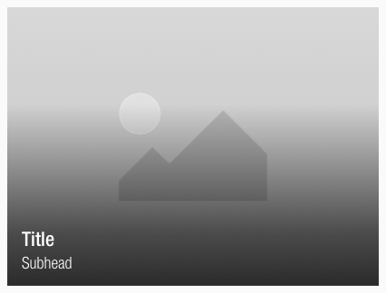
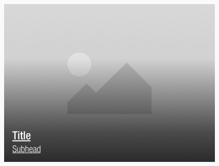
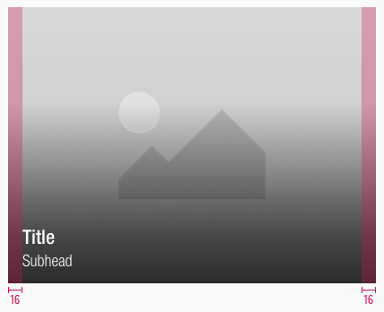
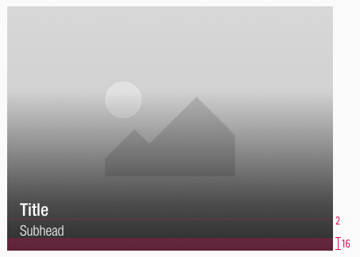
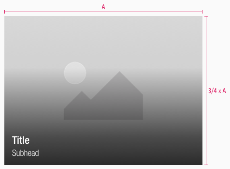
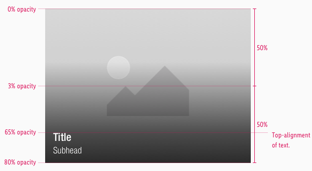

<AlertInfo alertHeadline="Modifiable">
Please ensure to comply with the corporate identity. A detailed list what can be modified can be found [here](#what-can-be-modified).
</AlertInfo>

# Teaser

Use the teaser component to attract attention and build excitement and expectations through curiosity.

It consists of an image and a text to underline the visual meaning.

---

## Recommendations

- Use the title and subhead **only in a single-line scenario** to ensure a good readability and accessibility to avoid low contrast.
- Try to keep the 4:3 ratio to guarantee the right display in each breakpoint.
- Otherwise it’s ratio is completely free adjustable.

---

## Overall styling

- The title uses the text-style **large-bold**.
- The subhead comes in the text-style **basic**.
- The line-height is always **120%**.
- The image is overlayed by a gradient with a default-color in **basic-black**.
- The gradient uses **hard-light** as a background-blend-mode.
- When a teaser is hovered, the text is **underlined** and the **curser turns into a pointer**.

| Types | Default | Hover / focus |
|---|---|---|
| Title |  |  |
| With subhead |  |  |

---

## Spacing & Measurements

| Types | Attributes | Preview |
|---|---|---|
| Horizontal spacing | padding: 16px |  |
| Vertical spacing | padding: 16px distance: 2px |  |
| Size | default size of 4:3 |  |
| Gradient | the image is overlayed with a gradient |  |

---

## What can be modified?

- Override the text.
- Adjust the ratio to any size but please try to stick to a 4:3-ratio.

### Our workflow in Sketch

- Use the "Overrides" function to customize the teaser.
