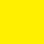

<AlertWarning alertHeadline="Not modifiable">
It is mandatory to maintain the appearance and behavior of these components.
</AlertWarning>

# Colors

Colors help to emphasize and highlight your brand's appearance.

---

## Brand Colors

- The SCHWARZ brand colors communicate the personality of the brand.

### Brand-primary

| Name | Values | Color |
|---|---|---|
| base | HEX: #6E1E6E RGB: 110 / 30 / 110 |  |

### Brand-secondary

| Name | Values | Color |
|---|---|---|
| base | HEX: #41053C RGB: 65 / 5 / 60 |  |

### Brand-info

| Name | Values | Color |
|---|---|---|
| base | HEX: #5F7DAA RGB: 95 / 125 / 170 |  |
| dark | HEX: #4B6487 RGB: 75 / 100 / 135 |  |
| darker | HEX: #3C506E RGB: 60 / 80 / 110 |  |
| darkest | HEX: #2D3C50 RGB: 45 / 60 / 80 |  |

### Brand-attention

| Name | Values | Color |
|---|---|---|
| base | HEX: #FFD746 RGB: 255 / 215 / 70 |  |
| dark | HEX: #E6B43C RGB: 230 / 180 / 60 |  |
| darker | HEX: #C8912D RGB: 200 / 145 / 45 |  |
| darkest | HEX: #AF6E00 RGB: 175 / 110 / 0 |  |

---

## Additional colors

### Danger

- It stands for danger and shows an error or a malfunction.
- In the digital environment, red is only used to a reduced extent as an additional color.

| Name | Values | Color |
|---|---|---|
| base | HEX: #E3000F RGB: 277 / 0 / 15|  |
| dark | HEX: #B5000C RGB: 181 / 0 / 12 |  |
| darker | HEX: #880009 RGB: 136 / 0 / 9 |  |
| darkest | HEX: #5A0006 RGB: 90 / 0 / 6 |  |

### Success

- In our case this color scheme indicates success.

| Name | Values | Color |
|---|---|---|
| base | HEX: #05A54B RGB: 5 / 165 / 75 |  |
| dark | HEX: #04843C RGB: 4 / 132 / 60 |  |
| darker | HEX: #03632D RGB: 3 / 99 / 45 | |
| darkest | HEX: #02421E RGB: 2 / 66 / 30 |  |

### Mark

- It isn't used very often.
- It offers a low contrast ratio to a light background in the digital department.

| Name | Values | Color |
|---|---|---|
| base | HEX: #FFF000 RGB: 255 / 240 / 0 |  |

---

## Grayscale

- It is used to display the status and character of messages.
- Especially the grayscale stands for different states.
- The **background** color is used exclusively for a page background.

| Name | Values | Color |
|---|---|---|
| base | HEX: #878787 RGB: 135 / 135 / 135 |  |
| background | HEX: #FAFAFA RGB: 250 / 250 / 250 |  |
| lightest | HEX: #EBEBEB RGB: 235 / 235 / 235 |  |
| lighter | HEX: #C6C6C6 RGB: 198 / 198 / 198 |  |
| light | HEX: #9D9D9D RGB: 157 / 157 / 157 |  |
| dark | HEX: #505050 RGB: 80 / 80 / 80 |  |

---

## Basic

- Colors for highest contrast.

| Name | Values | Color |
|---|---|---|
| white | HEX: #FFFFFF RGB: 255 / 255 / 255 |  |
| black | HEX: #000000 RGB: 0 / 0 / 0 |  |

---

### Workflow in Sketch

- If you want to change the color or turn it off, look into its symbols „Overrides“-function.
