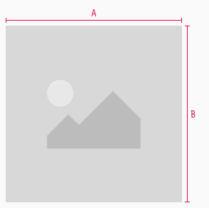
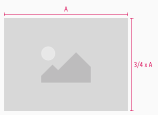

<AlertInfo alertHeadline="Modifiable">
Please ensure to comply with the corporate identity. A detailed list what can be modified can be found [here](#what-can-be-modified).
</AlertInfo>

# Images

These elements are used as placeholders in symbols or on mockups.

---

## Recommendations

- There is a lot to consider when selecting the appropriate image component.
- To make layouting with pictures easier, we recommend that the picture symbols follow our 8pt grid - both in width and height.
- Furthermore, the sample content should always be adapted to the appropriate aspect ratio.
- You shouldn't use too many different image formats in one layout, as fewer image formats are better suited for use in design, production and website performance.

| Ratio | Description | Example |
|--|--|--|
| Free ratio | The image scales as large as possible. Use this format for almost all UX elements or background images. Height and width can be random but should always be divisible by 8. |  |
|4:3 ratio | Can only be used in a ratio of 4:3. Mainly used for product images or teasers.  The fixed aspect ratio also ensures that the images look the same everywhere and, for example, are not cropped. |  |

---

## What can be modified?

- Override the content.
- Adjust the ratio (only "free-ratio" symbol).
- Adjust height and width.

### Our workflow in Sketch

- These symbols are always placeholders.
- These placeholders can later easy be replaced by inserting sample content images.
- To set an image, use the "Overrides" function "Choose Image".
