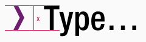
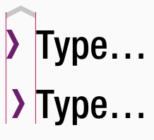
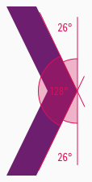
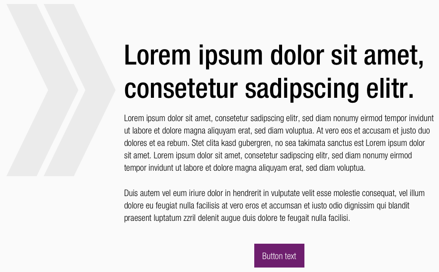

<AlertInfo alertHeadline="Modifiable">
Please ensure to comply with the corporate identity. A detailed list what can be modified can be found [here](#what-can-be-modified).
</AlertInfo>

# Key visual

The key visual is an illustrative sign to emphasize individual content.

---

## Recommendations

- Please keep in mind that this element is just a decorative element.
- It can be used as a highlight element before texts or free in the layout.
- This element is intended for restrained use and isn't be used as a pattern.
- The decorative element can be used for placative sections.
- Please coordinate applications with the [SCHWARZ brandmangement](mailto:brandmanagement@mail.schwarz).

---

### Overall styling

- The shape can be filled within any **basic-**, **brand-primary-base-**, **gray-color**.
- The element can only be scaled proportionally.
- There is no outlined keyvisual available.

---

## Spacing & Measurements

- In combination with a text, the height of the key visual is based on the verse height of the text.

| Types | Attributes | Preview |
|---|---|---|
| Height | x-height of the text element |  |
| Distance | optically aligned |  |
| Angle | Outer angle: 26° Inner angle: 128° |  |

---

## Examples

 

---

## What can be modified?

- Override the color.
- Adjust the size proportionally.

### Our workflow in Sketch

- To individualize the decorative key visual in your **product** you need to detach/unlink the complete symbol from the CAKE UI Kit.
- Used the element specifically and scale the single symbol to the right width or height.
