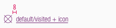

<AlertWarning alertHeadline="Not modifiable">
It is mandatory to maintain the appearance and behavior of these components.
</AlertWarning>

# Links

A reference for the user that can lead directly to an external or internal destination by clicking or tapping on it.

---

## Overall styling

- The text-style depends on the body text and is either **small**, **basic** or **large**.
- A link can have multiple states: **default/visited**, **hover/focus**, **active/pressed**.
- The appearance of the state depends on the usage or context.
- There’s also a positive and negative version to layout on a light or dark background.
- The icon can only be placed **before**, **not after** the link.
- Icons are always displayed like in the font color.

---

## Positive version

- Use the positive version if you want to display a link on a light background.
- Always make sure you have enough contrast when choosing the background.

| State | Attributes | Preview |
|---|---|---|
| Default / visited | text-color: brand-primary-base text-decoration: underline |  |
| Hover / focus | text-color: brand-secondary-base text-decoration: underline |  |
| Active / pressed | text-color: brand-secondary-base |  |

---

## Negative version

- Use the negative version if you want to display a link on a dark background.
- Always make sure you have enough contrast when choosing the background.

| State | Attributes | Preview |
|---|---|---|
| Default / visited | text-color: basic-white text-decoration: underline |  |
| Hover / focus | text-color: gray-light text-decoration: underline |  |
| Active / pressed | text-color: gray-light |  |

---

## Text styles

### Small

| Breakpoint | Font size | Preview |
|---|---|---|
| LG | 14px |  |
| MD-XS | 12px |  |

### Basic

| Breakpoint | Font size | Preview |
|---|---|---|
| LG | 18px |  |
| MD-XS | 16px |  |

### Large

| Breakpoint | Font size | Preview |
|---|---|---|
| LG | 22px |  |
| MD-XS | 20px |  |

---

## Spacing & measurements

| Type | Attributes | Preview |
|---|---|---|
| Vertical spacing | 8px between icon and label |    |
| Icon size | small: 16x16px basic: 24x24px large: 32x32px |     |

---

### Our workflow in Sketch

- Take one of the text styles for the different font sizes to display a linked text.
- The text style is then manually adapted to the status to be displayed (e.g. hover/focus: underlined, brand-secondary-base,…).
- Detach the text-style if you want to show a link in a copy-text.
