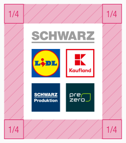
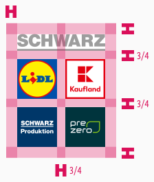

<AlertWarning alertHeadline="Not modifiable">
It is mandatory to maintain the appearance and behavior of these components.
</AlertWarning>

# Logo

The logo gives a visual representation of your company brand.

---

## General

- The SCHWARZ logo has a high recognition value and serves as the basis for a brand's visual identity.
- The logo is unchangeable.
- The SCHWARZ logo is available at [SCHWARZ brandmanagement](mailto:brandmanagement@mail.schwarz).

---

## Protection zone

- In order to guarantee the integrity of the SCHWARZ logo, there is a protective zone that is free of visual disturbances and distractions.
- No other graphic or typographic elements should be placed in this protection zone.
- Even image elements in the background should be reassured.
- The protection zone is 1/4 of the logo width.

---

## Layout

- Distances between individual elements inside of the logo are determined by the width of the letter "**H**" from the "SCHWARZ" logotype.

---

## Extension

- In the layout, the height of the logo is adjusted.
- The extension takes place if the logo is positioned close to  a screen border.
- Thereby the height of the logo is extended upwards.
- This extension is **1/10** of the logo width.

 

