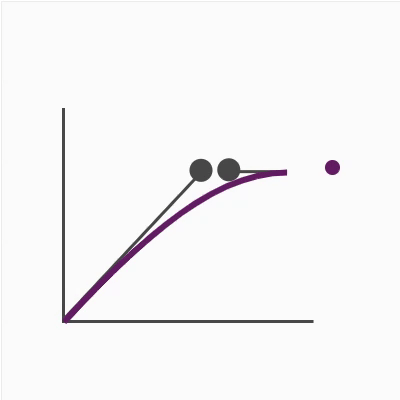
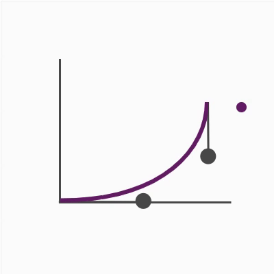
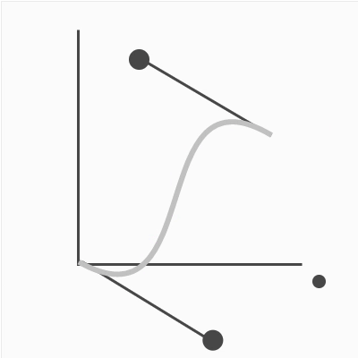
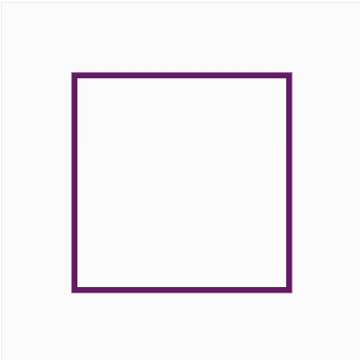

<AlertWarning alertHeadline="Not modifiable">
It is mandatory to maintain the appearance and behavior of these motions.
</AlertWarning>

# Motion

For SCHWARZ Brand, an effective UI animation makes a visual statement that combines both form and function. It enhances visual feedback, facilitates orientation and directs users' attention. The SCHWARZ Brand animation effects enhance a sense of causal relationships and bring a distinct personality.

## General principles

The core principles of the SCHWARZ Brand identity are **proximity**, **diversity** and **foresight**.

**Proximity** | **Diversity** |**Foresight**
---------|----------|---------
As a leading retailer, SCHWARZ Group is a part of the daily lives of millions of people and it is serving people's needs on a local level. | SCHWARZ Group has diverse fields of activity – the entire value chain of food goods, from production to distribution/trade, to disposal and recycling. Diversity is also reflected in international orientation and the different cultural environments in which retail formats operate. | SCHWARZ Group is farsighted in regard to the customer experience and sets its course today in order to be successful tomorrow. New challenges such as digitalization are seen as opportunities and are embraced in business models.

## Motion principles

Motion principles exist to ensure that SCHWARZ core brand principles are conveyed through animation.

**Assistive**| **Simple** | **Focused**
---------|----------|---------
To ensure that information sources are transported efficiently, motion is used to assist the flow of information. | Motion is used purposefully and clearly in visualization of simple, easy-to-follow actions. | There should be a clear focus on the harmonious relationship between design and functionality.

### Recommendation

We recommend combining the easing specification with the time tokens to create the SCHWARZ brand experience. The listed examples serve as orientation for possible applications.

> Motion effects should be carefully selected.

## Specifications

### Easing

Easing determins the rate of change of a parameter over time. 
The easing function defines how an animation changes speed over the course of the action. In reality, objects tend to accelerate or decelerate during their motion.
 SCHWARZ Motion defines these easing functions.

Preview | Transition specification
---------|----------
 | **schwarz-ease-out**  This transition specification is best suited for animation of fade-in objects.  cubic-bezier (0.61, 1, 0.88, 1)
 | **schwarz-ease-in**  This animation is especially suitable for objects that leave a section of the image or are faded out from the image.  cubic-bezier (0.55, 0, 1, 0.45)
 | **schwarz-easeInOutCubic**  This effect softens objects and draws attention to itself, so it should be used specifically for larger movements.  cubic-bezier (0.68, -0.6, 0.32, 1.6)

### Duration / Timing

When choosing the right duration, consider the complexity of the element and the amount of movement.

Micro animations | Macro animations
---------|----------
Micro animation cover a small area, e.g color, hover states, accordions, tooltips, slider (indicators), etc. | Macro animation cover a larger visual area which includes a movement across the screen, larger panel or popover, page transition, etc.

### Duration tokens

Token | Duration time (milliseconds) | Duration type
---------|----------:|:---------:
schwarz-duration-10 | 200 ms | Micro ▒
schwarz-duration-20 | 400 ms | Micro ▒
schwarz-duration-30 | 600 ms | Micro ▒
schwarz-duration-40 | 800 ms | Micro ▒
schwarz-duration-50 | 1200 ms | Macro █
schwarz-duration-60 | 1400 ms | Macro █
schwarz-duration-70 | 1600 ms | Macro █
schwarz-duration-80 | 1800 ms | Macro █
schwarz-duration-90 | 2000 ms | Macro █
schwarz-duration-100 | 2200 ms | Macro █
schwarz-duration-110 | 2400 ms | Macro █

## Effect examples

Preview | Type
---------|---------
 | **Fade-in**  schwarz-ease-out schwarz-duration-40
 | **Slide-fade**  schwarz-ease-in schwarz-duration-40
 | **Fill**  schwarz-easeInOutCubic schwarz-duration-40
 | **Color**  schwarz-ease-out schwarz-duration-40
 | **Side-fold**  schwarz-ease-in schwarz-duration-20
 |**Scale-fade**  schwarz-easeInOutCubic schwarz-duration-50

## Examples

Preview | Specification
---------|---------
 |  **Rotation** schwarz-ease-out  schwarz-duration-20
 | **Page transitions** schwarz-ease-in  schwarz-duration-20, schwarz-duration-10
 | **Section scrolling** schwarz-ease-out schwarz-duration-40
 | **Contextual** schwarz-easeInOutCubic schwarz-duration-10, schwarz-duration-40
 | **Parallax** schwarz-ease-out  schwarz-duration-40
 | **Key Visual** schwarz-ease-out schwarz-duration-40