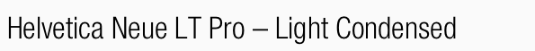
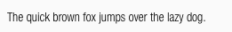
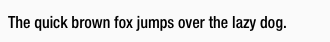
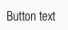
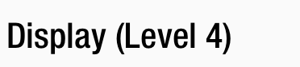
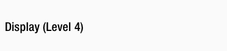
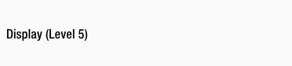

<AlertWarning alertHeadline="Not modifiable">
It is mandatory to maintain the appearance and behavior of these components.
</AlertWarning>

# Typography

It helps you to present your design and content as clearly and effectively as possible according to the SCHWARZ standard.

---

## Helvetica Neue LT Pro

- The Helvetica Neue displays the **functional** and **objective** style that was characteristic of fonts in the 1950s and 60s.
- The defined base color for all text-styles is **basic-black**.
- Use any color of **brand-primary**, **brand-secondary**, **brand-info**, **brand-attention**, **gray**, **danger** or **success** as text color as long as it has a high contrast ratio in interaction with backgrounds.

> - All types of headings should primarily be used in **single line scenarios**.
> - All text-styles are set to a letter-spacing of **0.2px**.
> - Capital letters are not allowed!

 
 

| Typeface | Text-style | Usage |
|---|---|---|
| Light Condensed | Small, Basic, Large, Button text | for body text, links, tables, lists, input-fields, etc. |
| Medium Condensed | Small Bold, Basic Bold, Large Bold, Headlines, Displays  | for headlines, labels, highlights, etc. |

---

## Small

- The typeface is always **light condensed**.
- The line height is always **140%**.
- Left, center, and right alignment are available for this font style.

| Breakpoint | Font size | Preview |
|---|---|---|
| LG | 14px |  |
| MD-XS | 12px |  |

## Small bold

- The typeface is always **medium condensed**.
- The line height is always **140%**.
- Left, center, and right alignment are available for this font style.

| Breakpoint | Font size | Preview |
|---|---|---|
| LG | 14px |  |
| MD-XS | 12px |  |

---

## Basic

- The typeface is always **light condensed**.
- The line height is always **140%**.
- Left, center, and right alignment are available for this font style.

| Breakpoint | Font size | Preview |
|---|---|---|
| LG | 18px |  |
| MD-XS | 16px |  |

## Basic bold

- The typeface is always **medium condensed**.
- The line height is always **140%**.
- Left, center, and right alignment are available for this font style.

| Breakpoint | Font size | Preview |
|---|---|---|
| LG | 18px |  |
| MD-XS | 16px |  |

---

## Large

- The typeface is always **light condensed**.
- The line height is always **140%**.
- Left, center, and right alignment are available for this font style.

| Breakpoint | Font size | Preview |
|---|---|---|
| LG | 22px | |
| MD-XS | 20px |  |

## Large bold

- The typeface is always **medium condensed**.
- The line height is always **140%**.
- Left, center, and right alignment are available for this font style.

| Breakpoint | Font size | Preview |
|---|---|---|
| LG | 22px |  |
| MD-XS | 20px |  |

---

## Button text

- The text-style is only used in the button component.
- The typeface is always **light condensed**.
- The line height is always **120%**.

| Breakpoint | Font size | Preview |
|---|---|---|
| LG | 18px |  |
| MD-XS | 16px |  |

---

## Headlines

- The page headlines are displayed in 5 levels.
- All levels have different font sizes.
- There are fixed font sizes from level 5 to level 1.
- The typeface is always **medium condensed**.
- The line height is always **120%**.
- Left, center, and right alignment are available for all headline levels.

### Headline (Level 1)

| Breakpoint | Font size | Preview |
|---|---|---|
| LG | 34px | 
| MD-XS | 32px |  |

### Headline (Level 2)

| Breakpoint | Font size | Preview |
|---|---|---|
| LG | 30px |  |
| MD-XS | 28px |  |

### Headline (Level 3)

| Breakpoint | Font size | Preview |
|---|---|---|
| LG | 26px |  |
| MD-XS | 24px |  |

### Headline (Level 4)

| Breakpoint | Font size | Preview |
|---|---|---|
| LG | 22px |  |
| MD-XS | 20px |  |

### Headline (Level 5)

| Breakpoint | Font size | Preview |
|---|---|---|
| LG | 18px |  |
| MD-XS | 16px |  |

---

## Displays

- The display text-style is defined in 5 levels.
- All levels have different font sizes.
- There are fixed font sizes from level 5 to level 1.
- The typeface is always **medium condensed**.
- The line height is always **120%**.
- Left, center, and right alignment are available for all display levels.

### Display (Level 1)

| Breakpoint | Font size | Preview |
|---|---|---|
| LG | 56px | 
| MD-XS | 32px |  |

### Display (Level 2)

| Breakpoint | Font size | Preview |
|---|---|---|
| LG | 52px |  |
| MD-XS | 28px |  |

### Display (Level 3)

| Breakpoint | Font size | Preview |
|---|---|---|
| LG | 48px |  |
| MD-XS | 24px |  |

### Display (Level 4)

| Breakpoint | Font size | Preview |
|---|---|---|
| LG | 44px |  |
| MD-XS | 20px |  |

### Display (Level 5)

| Breakpoint | Font size | Preview |
|---|---|---|
| LG | 40px |  |
| MD-XS | 16px |  |

---

## Lists

- Lists are used for text structuring.

| Type | Attributes | Preview |
|---|---|---|
| Bullets | Bulletpoints are special text characters whose form depends on the system. Size and color depend on the font style of the copy text. |  |
| Numbered | Numbers are text characters of the font. Size and color depend on the font style of the copy text. | 

---

## Spacing & measurements

| Type | Attributes | Preview |
|---|---|---|
| Vertical spacing | 32px between **Headline (Level 1)** and other headlines or body text  16px between **Headline (Level 2)** and other headlines or body text  8px between **Headline (Level 3)** and other headlines or body text  32px between body text and body text or headlines  8px between **Headline (Level 4)** and other headlines or body text  8px between **Headline (Level 5)** and other headlines or body text |  |

---

## Our workflow in Sketch

- All text styles are included in our CAKE UI Fundamental file.
- With Sketch v51.2 text styles can always be linked to this document – Use only these styles!
