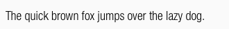
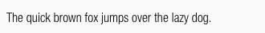
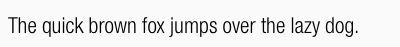
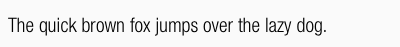
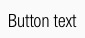
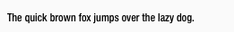
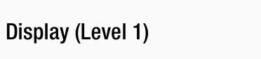
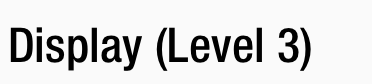

<AlertWarning alertHeadline="Not modifiable">
It is mandatory to maintain the appearance and behavior of these components.
</AlertWarning>

# Typography

It helps you to present your design and content as clearly and effectively as possible according to the SCHWARZ standard.

---

## Typefaces

- The Helvetica Neue displays the **functional** and **objective** style that was characteristic of fonts in the 1950s and 60s.
- **Capital letters are not allowed**.
- All types of headings should primarily be used in **single line scenarios**.
- The defined base color for all text-styles is **basic-black**.
- Use any color of **brand-primary**, **brand-secondary**, **brand-info**, **brand-attention**, **gray**, **danger** or **success** as text color as long as it has a high contrast ratio in interaction with backgrounds.

 
 

---

## Light Condensed

- The line height is always **140%**.
- It is mainly used, i. e. for body text, links, tables, lists, input fields, etc.

### Small

| Breakpoint | Font size | Preview |
|---|---|---|
| LG | 14px |  |
| MD-XS | 12px |  |

### Basic

| Breakpoint | Font size | Preview |
|---|---|---|
| LG | 18px |  |
| MD-XS | 16px |  |

### Large

| Breakpoint | Font size | Preview |
|---|---|---|
| LG | 22px | |
| MD-XS | 20px |  |

### Button text

- The text-style is only used in the button component.
- The line height is **120%**.

| Breakpoint | Font size | Preview |
|---|---|---|
| LG | 18px |  |
| MD-XS | 16px |  |

---

## Medium condensed

- The line height is always **140%**.
- It is mainly used, i. e. for headlines, labels, highlights.

### Small Bold

| Breakpoint | Font size | Preview |
|---|---|---|
| LG | 14px |  |
| MD-XS | 12px |  |

### Basic Bold

| Breakpoint | Font size | Preview |
|---|---|---|
| LG | 18px |  |
| MD-XS | 16px |  |

### Large Bold

| Breakpoint | Font size | Preview |
|---|---|---|
| LG | 22px |  |
| MD-XS | 20px |  |

---

## Page headlines

- The page headlines are displayed in 5 levels.
- All levels have different font sizes.
- There are fixed font sizes from level 5 to level 1.
- The typeface is always **medium-condensed**.
- The line height is always **120%**.

### Page headline (Level 1)

| Breakpoint | Font size | Preview |
|---|---|---|
| LG | 34px | 
| MD-XS | 32px |  |

### Page headline (Level 2)

| Breakpoint | Font size | Preview |
|---|---|---|
| LG | 30px |  |
| MD-XS | 28px |  |

### Page headline (Level 3)

| Breakpoint | Font size | Preview |
|---|---|---|
| LG | 26px |  |
| MD-XS | 24px |  |

### Page headline (Level 4)

| Breakpoint | Font size | Preview |
|---|---|---|
| LG | 22px |  |
| MD-XS | 20px |  |

### Page headline (Level 5)

| Breakpoint | Font size | Preview |
|---|---|---|
| LG | 18px |  |
| MD-XS | 16px |  |

---

## Displays

- The display text-style is defined in 3 levels.
- All levels have different font sizes.
- There are fixed font sizes from level 3 to level 1.
- The typeface is always **medium-condensed**.
- The line height is always **120%**.

### Display (Level 1)

| Breakpoint | Font size | Preview |
|---|---|---|
| LG | 56px | 
| MD-XS | 32px |  |

### Display (Level 2)

| Breakpoint | Font size | Preview |
|---|---|---|
| LG | 52px |  |
| MD-XS | 28px |  |

### Display (Level 3)

| Breakpoint | Font size | Preview |
|---|---|---|
| LG | 48px |  |
| MD-XS | 24px |  |

---

## Lists

- Lists are used for text structuring.

| Type | Attributes | Preview |
|---|---|---|
| Bullets | Bulletpoints are special text characters whose form depends on the system. Size and color depend on the font style of the copy text. |  |
| Numbered | Numbers are text characters of the font. Size and color depend on the font style of the copy text. | 

---

## Spacing & Measurements

| Type | Attributes | Preview |
|---|---|---|
| Vertical spacing | 32px between **Page headline (Level 1)** and other headlines or body text  16px between **Page headline (Level 2)** and other headlines or body text  8px between **Page headline (Level 3)** and other headlines or body text  32px between body text and body text or headlines  8px between **Page headline (Level 4)** and other headlines or body text  8px between **Page headline (Level 5)** and other headlines or body text |  |

---

## Our workflow in Sketch

- All text styles are included in our CAKE UI Fundamental file.
- With Sketch v51.2 text styles can always be linked to this document.
- Use only these styles!
