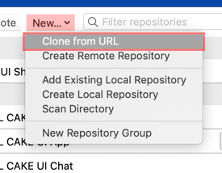
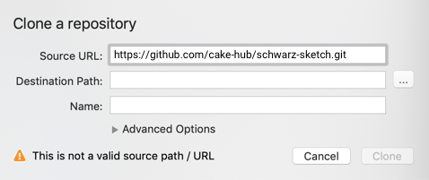
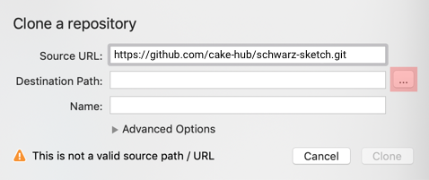
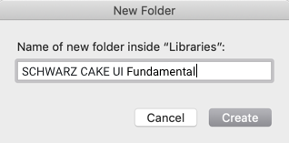
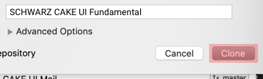
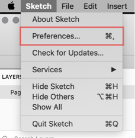
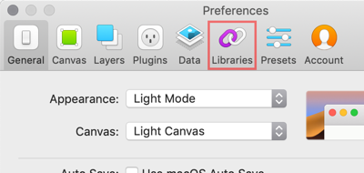
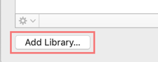
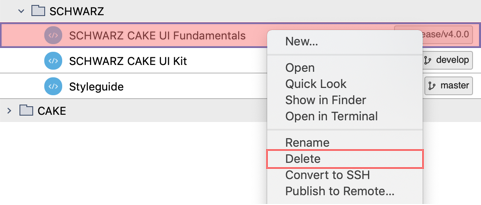
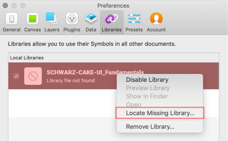

# Setup

How you get access to all our fine CAKE products.

---

## Introduction

- CAKE is available on GitHub.
- Use an external software to get access to our design system library files (e.g. Sourcetree).
- You need the **CAKE UI Fundamental** repository as a global library file linked in Sketch to work with any other CAKE UI product (e.g. App, Chatbot, Web, Mail, … ).

| Project | Link |
|---|---|
| Fundamental | <https://github.com/cake-hub/schwarz-sketch.git> |
| Web | <https://github.com/cake-hub/schwarz-web-sketch.git> |

## Newbies

Follow this tutorial if you:

1. **are not linked** to the world of CAKE.
1. **have not cloned** any repositories.
1. **have not added** library files and **have not used** plugins in Sketch.

### Clone repositories

- **Disconnect your VPN** if you are signed in to the SCHWARZ network and …
- **Switch your WiFi connection** to a free wifi (e.g. welcome@schwarz) if you are working in one of our offices.

| Steps | Description | Preview |
|---|---|---|
| 1 | Add new GitHub repositories by using the "New" select-field and choose "Clone from URL" |  |
| 2 | Copy the required [GitHub URL](#introduction) from the table above and paste it into the first input-field called "Source URL" | |
| 3 | Tab to the next input-field and click on "…" to choose the correct destination path | |
| 4 |  Create a new folder with the name of the repository on your local computer (e.g. under ../Schwarz-UX/Libraries/…) |  |
| 5 | Complete this process by hitting the button "Clone" | |

### Add libraries

| Steps | Description | Preview |
|---|---|---|
| 1 | Go to the preferences section in your Sketch software | |
| 2 | Choose the tab "Libraries" to show an overview of all your linked library files in Sketch | |
| 3 | Click on the "Add Library…" button and choose the library file (e.g. SCHWARZ CAKE UI Fundamental) from your new cloned folder | |

## Advanced

Follow this tutorial if you already:

1. **are linked** to the world of CAKE.
1. **have cloned** repositories before.
1. **have added** libraries and **have installed** plugins in Sketch.

### Replace repositories

- **Disconnect your VPN** if you are signed in to the SCHWARZ network and …
- **Switch your WiFi connection** to a free wifi (e.g. welcome@schwarz) if you are working in one of our offices.

| Steps | Description | Preview |
|---|---|---|
| 1 | Go to Sourcetree, right-click on a cloned repository and choose delete (e.g. SCHWARZ CAKE UI Core) | |
| 2 | Confirm your remove by clicking on "Also Move to Trash" |  |
| 3 | Add new GitHub repositories by using the "New" select-field and choose "Clone from URL" |  |
| 4 | Copy the required [GitHub URL](#introduction) from the table above and paste it into the first input-field called "Source URL" | |
| 5 | Tab to the next input-field and click on "…" to choose the correct destination path | |
| 6 |  Create a new folder with the name of the repository on your local computer (e.g. under ../Schwarz-UX/Libraries/…) |  |
| 7 | Complete this process by hitting the button "Clone" | |

### Locate missing libraries

| Steps | Description | Preview |
|---|---|---|
| 1 | Go to the preferences section in your Sketch software | |
| 2 | Choose the tab "Libraries" to show an overview of all your linked library files in Sketch | |
| 3 | Right-click on the missing library file and locate it again to your new cloned folder | |
