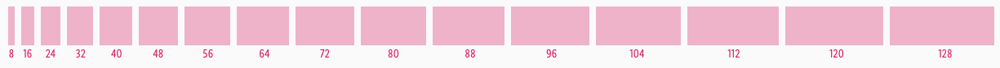

<AlertWarning alertHeadline="Not modifiable">
It is mandatory to maintain the appearance and behavior of these components.
</AlertWarning>

# Spacing

Working with CAKE brings fixed spaces for layouts.

---

## Usage

- The distances between the components are defined differently.
- Spaces cannot be combined!
- Use different spaces in the perfect order to show hierarchies, create clear areas or obvious structures.
- **Hint!** It's not necessary to follow the "rule of 8" guidelines in a component for vertical spacing. Please, try not to block your layout sticking to close to the rules.

---

## Horizontal direction

- All distances are set to an increment of 8 (8, 16, 24, 32, 40, 48, … 128) because of the approach of responsive web design and the component's behavior.

---

## Vertical direction

- Spaces are the horizontal distances between two components.
- They only exist in the sizes of 8, 16, 32, 64 and 128px (double-up every time).
- They describe the distance from one component to another.
- Spaces are placed as an independent element – this prevents the same component from having different distances in a different context.
- They are only used below a component.

---

## Examples

- The height of a component depends on its content but should also be set to a value divisible by 8 in its default state.
- It is not mandatory that the **vertical** spacing within a component is an increment of 8, but if it turns out that way it doesn't harm.
- The distance between components should follow the rule of 8.
- Margins or paddings are an increment of 8.

| Horizontal & vertical | Vertical |
|---|---|
|  |  |

---

## Our workflow in Sketch

- Vertical spaces are defined as symbols in Sketch - they are aligned with the text frame.
